# 電子証明書申請マニュアル

## 概要
このマニュアルは、ベトナムの電子証明書申請手続きについて説明します。

---

## ページ 1
 
1 
QUY TRÌNH CẤP BẢN SAO ĐIỆN TỬ ĐƯỢC CHỨNG THỰC  
TỪ BẢN CHÍNH 
 
Chứng thực bản sao điện tử từ bản chính là việc cơ quan, tổ chức có thẩm 
quyền căn cứ vào bản chính dạng văn bản giấy để chứng thực bản sao bằng hình 
thức điện tử là đúng với bản chính (1).  
Mô tả quy trình: 
Bước 
Thao tác 
Đối tượng 
0 
- 
Tổ chức, cá nhân có thể đặt lịch hẹn với cơ quan có 
thẩm quyền thực hiện chứng thực bằng cách: Đăng nhập 
vào cổng Dịch vụ công Quốc gia (DVCQG)/thủ tục hành 
chính: “ Chứng thực bản sao từ bản chính giấy tờ, văn bản 
do cơ quan, tổ chức có thẩm quyền của Việt Nam cấp hoặc 
chứng nhận’"/cơ quan có thẩm quyền thực hiện chứng thực 
(điền đầy đủ thông tin tỉnh, huyện, xã) và đặt lịch hẹn. 
- 
Khi thực hiện chứng thực, tổ chức, cá nhân mang bản 
chính giấy tờ cần chứng thực và các giấy tờ liên quan tới 
trực tiếp cơ quan có thẩm quyền thực hiện chứng thực để 
yêu cầu chứng thực bản sao điện tử từ bản chính 
Sau khi được tiếp nhận bản chính để chứng thực, tổ chức, 
cá nhân nộp lệ phí chứng thực trực tiếp tại nơi thực hiện 
chứng thực 
Người 
dân/Doanh 
nghiệp 
1 
Công chức thực hiện công tác chứng thực kiểm tra bản chính 
cần chứng thực, nếu bảo đảm các quy định về chứng thực thì 
đăng nhập vào cổng DVCQG, thực hiện tiếp nhận: 
(1) Với trường hợp tổ chức, cá nhân đặt lịch hẹn: Công 
chức thực hiện công tác chứng thực chọn lịch hẹn 
trong danh sách lịch hẹn (thông tin tổ chức, cá nhân 
được tự động lấy từ thông tin tài khoản) 
(2) Với trường hợp tổ chức, cá nhân không đặt lịch hẹn, 
Công chức thực hiện công tác chứng thực nhập thông 
tin của tổ chức, cá nhân (nếu tổ chức, cá nhân có tài 
Quyền tạo 
bản sao 
(Công chức 
tiếp nhận hồ sơ 
chứng thực - 
Cán bộ tư 
pháp) 
                                            
(1) Khoản 9 Điều 3 Nghị định số 45/2020/NĐ-CP ngày 08/04/2020 của Chính phủ về thực hiện thủ tục hành chính 
trên môi trường điện tử 

---
## ページ 2
 
2 
khoản DVCQG thì khi nhập tài khoản DVCQG, thông 
tin tổ chức, cá nhân được tự động điền theo thông tin 
tài khoản; nếu tổ chức, cá nhân không có tài khoản 
DVCQG thì nhập thông tin thư điện tử tổ chức, cá 
nhân cung cấp). 
Sau đó, Công chức thực hiện công tác chứng thực tạo bản 
scan, đính kèm file scan bản chính lên hệ thống, nhập lời 
chứng và thực hiện chuyển hồ sơ trình lãnh đạo ký. 
2 
Lãnh đạo đăng nhập vào Cổng DVCQG, kiểm tra hồ sơ 
chứng thực đang trình, ký số lên bản scan. 
Quyền Ký 
bản sao 
(Lãnh đạo 
Phòng Tư pháp 
hoặc UBND 
cấp xã) 
3 
Cán bộ quản lý con dấu cơ quan đăng nhập vào cổng 
DVCQG, cấp số chứng thực điện tử do hệ thống cấp tự động 
theo Sổ chứng thực bản sao điện tử từ bản chính, ký số cơ 
quan lên bản scan, hoàn thiện quy trình chứng thực bản sao 
điện tử từ bản chính. 
Bản sao điện tử đã chứng thực từ bản chính được đồng bộ về 
tài khoản cổng DVCQG (trong trường hợp thông tin đăng ký 
trùng với thông tin tài khoản DVCQG) hoặc gửi về email cho 
người đăng ký theo email người đăng ký cung cấp. 
Quyền ký 
số cơ quan 
(cán bộ quản lý 
con dấu cơ 
quan- Văn thư) 
 
Ghi chú: lệ phí thực hiện, thời gian thực hiện 3 bước phải bảo đảm quy định 
về thời hạn giải quyết theo quy định của pháp luật về chứng thực. 
Yêu cầu: Đơn vị tiếp nhận hồ sơ phải có máy scan; người ký chứng thực và 
đóng dấu được cài đặt chữ ký số. 
 
 
 
 
 

---
## ページ 3
 
3 
QUY TRÌNH 
TIẾP NHẬN, KIỂM TRA TÍNH CHÍNH XÁC CỦA THÀNH PHẦN 
HỒ SƠ THỦ TỤC HÀNH CHÍNH LÀ BẢN SAO ĐIỆN TỬ                
ĐƯỢC CHỨNG THỰC TỪ BẢN CHÍNH 
 
Bước 
Thao tác 
Đối tượng 
0 
Người dân/Doanh nghiệp (tổ chức, cá nhân) nộp hồ sơ điện 
tử thực hiện thủ tục hành chính, trong thành phần hồ sơ đầu 
vào của thủ tục hành chính có bản sao điện tử đã chứng 
thực từ bản chính. Việc nộp thông qua 02 cách: 
- Dẫn nguồn từ Kho quản lý dữ liệu điện tử của tổ chức, cá 
nhân trên Cổng dịch vụ công quốc gia 
- Đăng tải bản sao điện tử đã chứng thực từ bản chính lấy từ 
địa chỉ email đã cung cấp. 
Người 
dân/Doanh 
nghiệp 
1 
Cán bộ giải quyết thủ tục hành chính kiểm tra tính toàn vẹn 
dữ liệu và tính chính xác của chữ ký số trên bản chứng thực 
khi mở bản chứng thực thông qua công cụ hỗ trợ cán bộ, 
công chức kiểm tra tính hợp lệ của chữ ký số trên bản sao 
điện tử được chứng thực, bao gồm chữ ký số chuyên dùng 
chính phủ và chữ ký số công cộng được tích hợp trên Cổng 
dịch vụ công quốc gia và Hệ thống thông tin một cửa điện 
tử cấp bộ, cấp tỉnh. 
Công cụ giúp cung cấp các thông tin về: tính toàn vẹn của 
bản sao điện tử đã được ký số, thông tin chứng thư số của 
lãnh đạo và cơ quan có thẩm quyền chứng thực còn hiệu lực 
tại thời điểm ký, dấu thời gian tương ứng chữ ký số có hiệu 
lực, tính hợp pháp của tổ chức cung cấp dịch vụ chứng thực 
chữ ký số. 
Cán bộ tiếp 
nhận, giải 
quyết TTHC 
 
 
 

---
## ページ 4
 
4 
 
QUY TRÌNH XỬ LÝ HỒ SƠ CHỨNG THỰC ĐIỆN TỬ 
 
* Đăng nhập hệ thống: Cán bộ được phân quyền (lãnh đạo, cán bộ tư pháp, 
văn thư) thực hiện truy cập hệ thống tại địa chỉ https://quantri.dichvucong.gov.vn 
và thực hiện đăng nhập (Lưu ý: tài khoản đã được phân quyền tương ứng với từng 
vai trò xử lý) 
 
I. ĐỐI TƯỢNG “QUYỀN TẠO BẢN SAO” (cán bộ tư pháp - cán bộ tiếp 
nhận hồ sơ) 
Cán bộ tư pháp sau khi truy cập hệ thống thành công (địa chỉ 
https://quantri.dichvucong.gov.vn), sẽ hiển thị màn hình như sau: 
Căn cứ vào cách thức người dân, doanh nghiệp thực hiện đăng ký chứng thực 
điện tử bằng hình thức đặt lịch hẹn hay đến trực tiếp mà cán bộ tư pháp cũng có 02 
hình thức xử lý cho người dân, doanh nghiệp. 
 

---
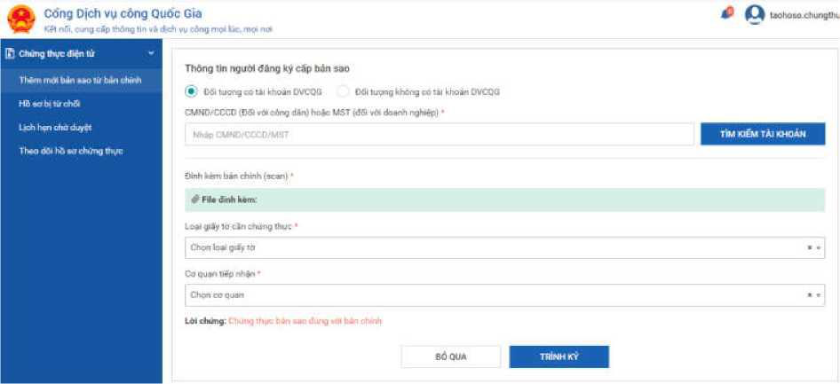
## ページ 5
 
5 
2.1. Xử lý không qua lịch hẹn 
Cán bộ tư pháp chọn menu [Thêm mới bản sao từ bản chính], hệ thống hiển 
thị màn hình như sau: 
Lúc này, tại cơ quan tư pháp, cán bộ tư pháp hỏi người dân, doanh nghiệp có 
tài khoản cổng DVCQG hay không. Nếu có tài khoản cổng DVCQG thì yêu cầu 
ND/DN cung cấp CMND/CCCD hoặc mã số thuế. 
Cán bộ tư pháp nhập CMND/CCCD hoặc mã số thuế để thực hiện tìm kiếm 
tài khoản như sau: 
 

---

## ページ 6
 
6 
Trường hợp người dân không có tài khoản DVCQG thì cán bộ Tư pháp 
check radio box “Đối tượng không có tài khoản DVCQG”, sau đó nhập email của 
ngời dân như sau: 
 
Sau đó cán bộ tư pháp đính kèm bản scan của bản gốc, file đính kèm bắt 
buộc định dạng .pdf và dung lượng <= 30mb và chọn loại giấy tờ cần chứng thực, 
sau đó bấm nút [Trình ký] để trình tới lãnh đạo đơn vị. 
2.2. Xử lý đặt lịch hẹn 
Trường hợp người dân đã đặt lịch hẹn trên cổng DVCQG, cán bộ tư pháp 
chọn menu [Lịch hẹn chờ duyệt], hệ thống hiển thị màn hình như sau: 
 

---

## ページ 7
 
7 
 
 
Hệ thống hiển thị toàn bộ các lịch hẹn của đơn vị mà người dân, doanh 
nghiệp đã hẹn, cán bộ tư pháp chọn 1 lịch hẹn để xử lý, bấm nút [Xử lý], hệ thống 
hiển thị màn hình như sau: 
Trên giao diện hiển thị thông tin của người dân, doanh nghiệp đăng ký 
chứng thực, loại giấy tờ cần chứng thực, cán bộ tư pháp cần scan bản giấy của giấy 
tờ (người dân mang bản giấy tới), sau đó đính kèm lên trên hệ thống, file đính kèm 
bắt buộc định dạng .pdf và dung lượng <= 30mb. 
Sau khi đính kèm bản scan, cán bộ tư pháp bấm nút [Trình ký] để trình tới 
lãnh đạo của đơn vị mình. 
> Dời lịch hẹn 
Trong trường hợp lịch hẹn của người dân, doanh nghiệp trùng lịch với lịch 
của cơ quan hoặc cán bộ bận việc đột xuất, hệ thống cung cấp chức năng cho cán bộ 
 

---
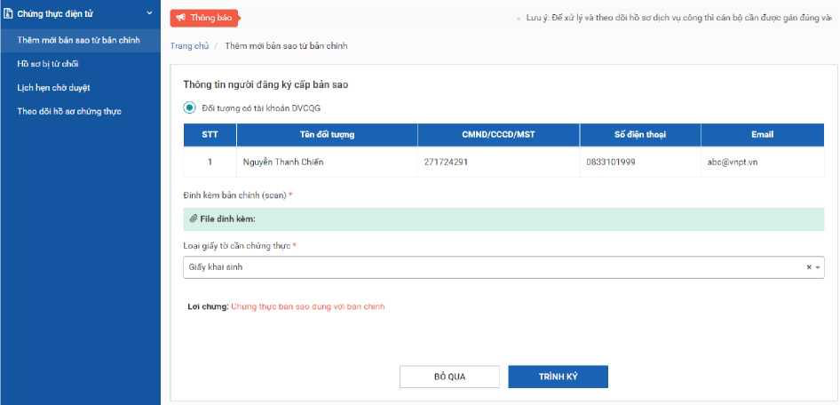
## ページ 8
 
8 
tư pháp dời lịch hẹn. Để dời lịch hẹn, cán bộ bấm nút “Dời lịch hẹn” của lịch hẹn 
cần dời, hệ thống hiển thị màn hình như sau: 
Cán bộ tư pháp chọn lại giờ hẹn, nhập lý do hẹn, bấm nút [Đặt lại lịch hẹn]. 
Sau khi đặt lại lịch hẹn thành công, hệ thống sẽ gửi tin nhắn tới số điện thoại của 
người dân, doanh nghiệp, đồng thời gửi thông báo tới tài khoản cổng DVCQG của 
người dân, doanh nghiệp. 
 

---
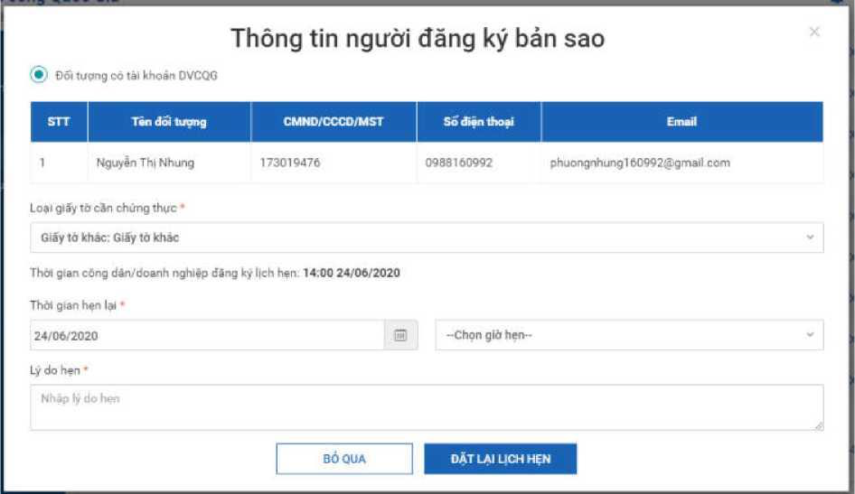
## ページ 9
 
9 
B chúng thục diện hx 
v 
I Hâm inm bin MO TU bin chinh »B 
BO b| lừ chái 
Ueh hẹn thó duy* thao dỗ« bò ma 
chung thư 
Chú ý: Ngày, giờ hẹn được hiển thị theo nguyên tắc giờ, ngày hẹn còn trống, 
giờ/ngày hẹn đã đầy sẽ ẩn đi không chọn được. 
2.3. Xử lý hồ sơ bị từ chối 
Hồ sơ bị từ chối là các hồ sơ do lãnh đạo đơn vị trả về: 
Các hồ sơ bị từ chối sẽ có 2 cách xử lý: 
- 
Cách 1: hủy hồ sơ, hủy bỏ hoàn toàn hồ sơ, dừng xử lý 
- 
Cách 2: Xử lý tiếp, cán bộ bấm nút “Xử lý tiếp” => cán bộ tư pháp có 
thể chỉnh sửa các thông tin như file scan... để trình ký lại lãnh đạo. 

---

## ページ 10
 
10 
 
II. ĐỐI TƯỢNG “QUYỀN KÝ BẢN SAO” (Lãnh đạo Phòng Tư pháp 
và UBND cấp xã) 
Lãnh đạo sau khi truy cập thành công hệ thống (địa chỉ 
https://quantri.dichvucong.gov.vn) sẽ hiển thị màn hình danh sách các bản sao chờ 
ký như sau: 
 
 
 
 
 

---

## ページ 11
 
11 
Lãnh đạo bấm nút [Xử lý], hệ thống hiển thị màn hình như sau: 
 
 
 
 
 
 
 
 
 
 
 
 
 
 
 
Chú ý: để ký số được thì máy tính của lãnh đạo phải được cài công cụ plugin 
ký số ( Vào địa chỉ: https://dichvucong.gov.vn; - Vào mục [Hỗ trợ] -> [Hướng dẫn 
sử dụng]; - Tiếp tục vào mục [Bộ ngành, địa phương] -> [Phần mềm hỗ trợ]. Nếu 
máy cài hệ điều hành window thì tải file ‘ 1. Plugin chữ ký số cho Window’, nếu 
máy cài hệ điều hành Mac thì tải file ‘2. Plugin chữ ký số cho Mac’. Tiến hành cài 
đặt file Plugin vừa tải về - có thể liên hệ với bộ phận kỹ thuật để được hướng dẫn 
cài đặt). 
 

---

## ページ 12
 
12 
Lãnh đạo bấm nút [Ký số], khi đó hệ thống gọi đến plugin để ký số như sau: 
 
 
 
Lãnh đạo bấm nút [Ok] trên plugin để thực hiện ký, sau khi ký plugin hiển 
thị file đã có chữ ký và lời chứng như sau: 
 
Hệ thống mặc định thêm trang trắng để hiển thị chữ ký và lời chứng, tuy 
nhiên trong trường hợp lãnh đạo muốn căn chỉnh vị trí thì click vào hình ảnh chữ
ký để kéo thả vị trí theo ý muốn. 
Lãnh đạo bấm nút [Áp dụng] trên plugin để hoàn tất việc ký, hệ thống sẽ
hiển thị file đã ký như sau: 

---
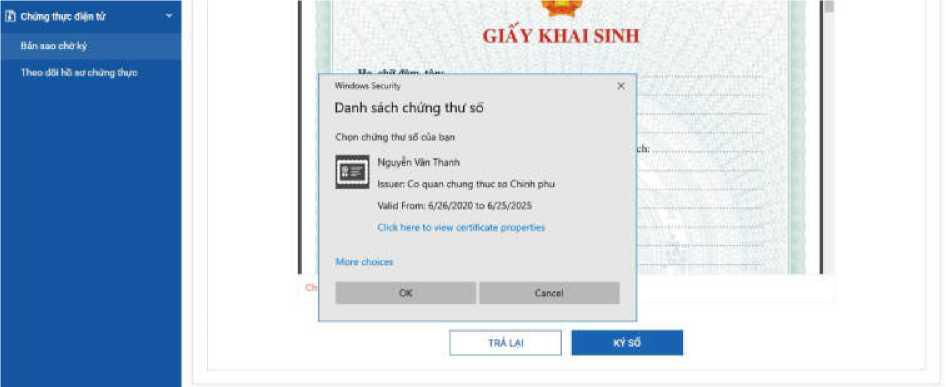
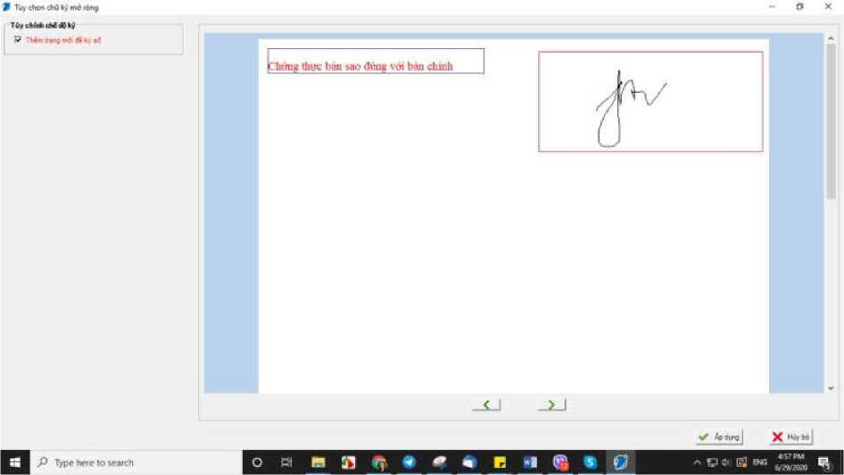
## ページ 13
 
13 
 
Lãnh đạo bấm nút [Chuyển cấp số và đóng dấu] để chuyển tới văn thư đóng dấu. 
 
 
 

---

## ページ 14
 
14 
III. ĐÓI TƯỢNG “QUYỀN ĐÓNG DẤU BẢN SAO” (văn thư) 
1. Quản lý sổ chứng thực 
 
 
Văn thư chọn menu [Quản lý sổ chứng thực], hệ thống hiển thị màn hình như sau: 
 
Tại màn hình quản lý sổ chứng thực, văn thư có thể thực hiện các chức năng: 
- Thêm mới sổ 
- Chỉnh sửa sổ 
- Xóa sổ 
- Xem thông tin sổ 
- Xuất báo cáo dữ liệu trong sổ 
 
 
 
Văn thư sau khi đăng nhập thành công, sẽ hiển thị màn hình như sau: 
 
 

---

## ページ 15
 
15 
a) Thêm mới sổ chứng thực 
Văn thư bấm nút [Thêm mới], hệ thống hiển thị màn hình như sau: 
 
 
 
Văn thư nhập các thông tin: Tên sổ chứng thực - Số bắt đầu sổ (chỉ nhập số) - 
Ngày mở sổ - Ngày đóng sổ. Bấm nút [Lưu] để hoàn tất việc thêm mới sổ. 
b) Chỉnh sửa sổ 
Để chỉnh sửa sổ, văn thư bấm icon [chỉnh sửa] trên danh sách, hệ thống hiển 
thị màn hình sau: 
 
 
Văn thư chỉnh sửa các thông tin và bấm nút [Lưu] để hoàn thành việc chỉnh sửa 

---
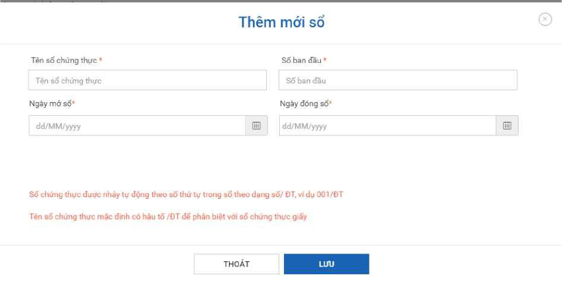
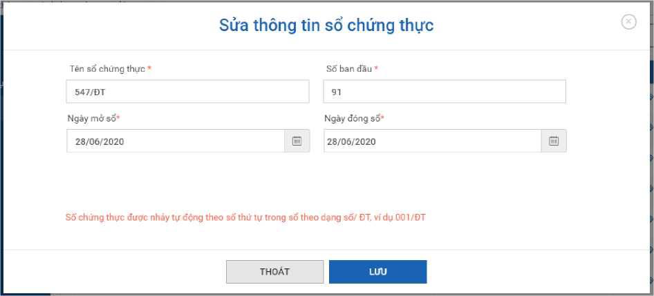
## ページ 16
 
16 
c) Xóa sổ 
Sổ chỉ được xóa khi sổ còn trống, sổ đã được cấp s không thể thực hiện xóa. 
Để xóa sổ người dùng bấm nút [Xóa] để thực hiện xóa sổ 
d) View thông tin sổ 
Văn thư bấm nút view thông tin sổ trên danh sách sổ, hệ thống hiển thị màn 
hình như sau: 
 
đ) Xuất báo cáo 
Văn thư bấm nút xuất báo cáo dữ liệu của sổ, hệ thống xuất báo cáo ra file 
excel như sau: 
 
 
 
 
 
Hệ thống hiển thị thông tin sổ và danh sách hồ sơ chứng thực được cấp trong sổ.
Tên sổchứng thư 598/ĐT
Số bắt đầu 10/ĐT 
Sổ hiện tại 
10/ĐT 
Ngày mở sổ 29/06/2020 
Ngày đóng sô 
29/06/2020 
Cơ quan quản lý sô chứng 
thưc
PhòngTư pháp 
1
Thông tin chứng thực trong sổ 
1 huentn@gmail.com Chứng minh nhân dân 
10/ĐT 
29/06/2020 
 
Tên đối tượng đăng ký chứng thực 

---

## ページ 17
 
17 
2. Cấp số và đóng dấu bản chứng thực điện tử 
Văn thư chọn menu [Bản sao chờ đóng dấu], hệ thống hiển thị danh sách các 
bản sao chờ đóng dấu như sau: 
 
 
 
 
 
Sỗ lung mải trang 10 • 
 
 
 
 
 
 
 
 
 
 
 
 
 
© Chúng thực điện tử Bán sao chờ 
đóng dấu Theo dõi ho sơ chứng 
thực Quán lý sổ chúng thực Quán 
lỹ gửi lại email Quán lý con dấu 
Với vai trò phụ 
trách Trang chủ 
Bản sao chờ đóng 
dấu Thông tin tìm kiếm 
Tìm kiếm theo đổi tượng (•) Tất cá 
Công 
dân
Doanh nghtệp 
Đổi tượng không
có tài khoán DVCQG 
Mã chứng thực 
Tên 
đối 
tượng/ 
số
CMT/CCCD/ MST/ Email 
Nhập mi chứng thực 
Tên đối tượng/ số CMT/CCCD/ MST 
^gày nộp từ ngày 
Đến ngày 
dd/MM/yyyy 
R 
dd/MM/yyyy 
R 
 
T 
im thấy 6 kết quả 
STT chứng thực 
Tên đối tượng đang ký 
Ngày dăng 
Trạng 
ký 
thãi 
 
G22.29- 
250620- 
,°n^ Nguyễn Thị Thu 
25/06/2020 
^ 
. . . . . .  
16 02 28 
'"'ứ lý Ly Xem tiên trình 
CỐNG TY CỒNG NGHÊ THÔNG Doanh 
TIN VNPT- CHI NHẢNH TẬP„ nghiệp ĐOÀN BƯU 
CHÍNH -TESTVI EN THÔNG VIỆT NAM 
26/06/2020 vM. rnv , 1512 07 Xử ^ ty Xem tiễn trình 
buonthiu@gmiail.com 
26/06/2020 V V I .  
15'40'27 Xứ lý iy Xem tiên trình 
G22.29- 
260620- J?n^ Nguyễn Thị Ngọc Huê 
26/06/2020 v V | .  rnv 16’15’12 Xử lý Ly Xem tien trình 
CÔNG TY CÔNG NGHỆ THÔNG Doanh 
TIN VNPT- CHI NHÁNH TẬP, nghiệp ĐOÀN BƯU 
CHÍNH -TESTVIÊN THÔNG VIỆT NAM 
29/06/2020 v
v
r
n
v  
16 32 37 Xứ lý Ly Xem tiên trình 
G22.99- 
290620- 
Nguyễn Thị Thu 
Số hàng mồi trang 10 ' 

---
## ページ 18
 
18 
Văn thư bấm nút [Xử lý] của 01 hồ sơ trên danh sách, hệ thống hiển thị như sau: 
 
 
 
Văn thư chọn sổ chứng thực, hệ thống tự động sinh số theo sổ chứng thực. Sau 
đó, văn thư bấm nút [Đóng dấu] để thực hiện đóng dấu cho bản sao, hệ thống gọi 
tới plugin để đóng dấu. 
Chú ý: Để đóng dấu được thì máy tính của văn thư phải được cài công cụ 
plugin ký số như hướng dẫn phần cài công cụ plugin ký số của lãnh đạo. 
 

---
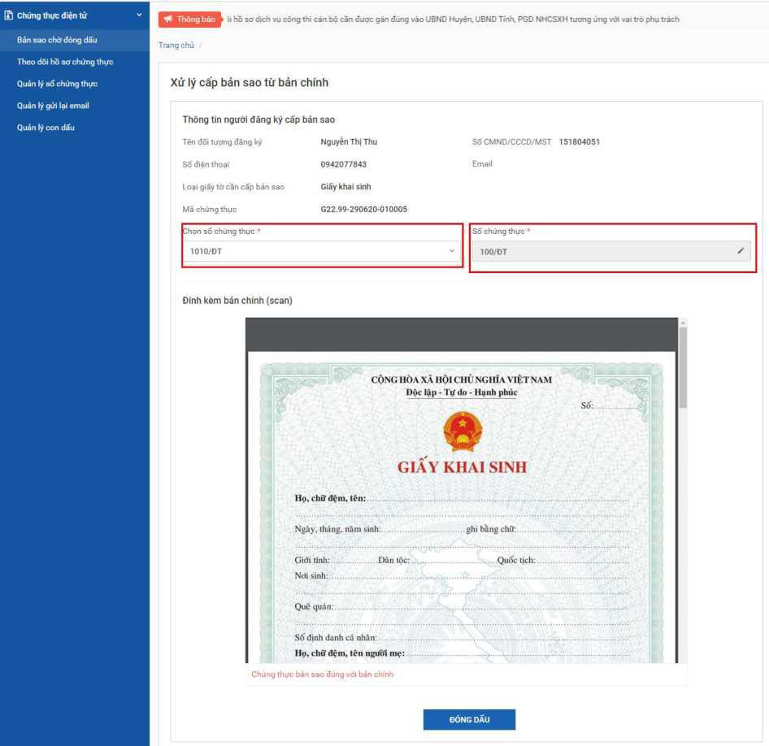

## ページ 19
 
19 
 
Văn thư chọn chứng thư số để đóng dấu, hệ thống hiển thị màn hình như sau: 
 
 
 
Văn thư bấm nút [Áp dụng] trên plugin để hoàn thành việc đóng dấu, khi đó hệ 
thống hiển thị bản đã đóng dấu như sau: 
Văn thư bấm nút [Hoàn thành và chuyển bản chứng thực điện tử tới người 
dân/doanh nghiệp], khi đó bản chứng thực điện tử sẽ được chuyển tới tài khoản 
Dịch vụ công Quốc gia của người dân/doanh nghiệp hoặc chuyển tới email trong 
trường hợp người dân/doanh nghiệp không có tài khoản dịch vụ công quốc gia./. 
 

---
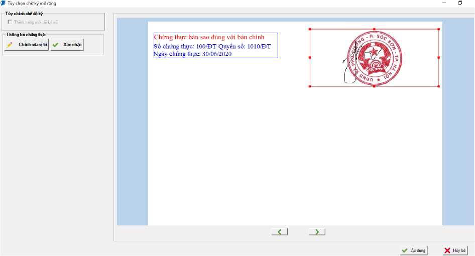

## ページ 20
 
20 
CÔNG OẢN
(p Cà con nhỏ Hoe 
ÚP a Viée lâm 
DOANH NGHIỆP 
f3 Khởi sư kinh doanh 
Lao đóng vã bào hiếm xá hỏi (ĩ) Tài
chểnh doanh nahièo 
HƯỚNG DẪN NGƯỜI DÂN/DOANH NGHIỆP 
TRA CỨU KẾT QUẢ CHỨNG THỰC ĐIỆN TỬ 
 
- Cán bộ hướng dẫn cho Người dân/doanh nghiệp đăng nhập vào tài khoản 
của mình trên Cổng Dịch vụ công Quốc gia để tra cứu, tìm kiếm bản chứng thực 
điện tử của mình 
- Bấm vào tên cá nhân của mình, vào “Thông tin cá nhân” 
 

---

## ページ 21
 
21 
 
 
 
 
 
 
 
  
- Vào “Thao tác xem giấy tờ” tải kết quả về.
 
 
 
 
 
 
C*ỒNG DỊCH VỤ CÔNG QUỐC GIA 
Két HÓI. cung cip thòng tin ỲÀ dịch vu cóng moI lúc mọt nơi 
o Lẻ Thị Đích Ngưyèt * 
X Ti. iny imtinhén 
CỐNG DẢN 
DOANH NGHIỆP 

---
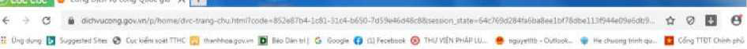

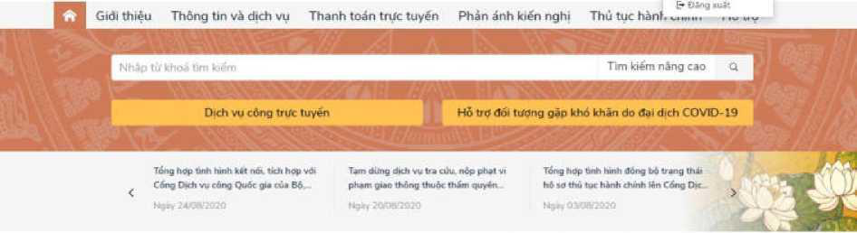
## ページ 22
 
22 
 
Bản sao điện tử được chứng thực từ bản chính dạng văn bản giấy có giá trị sử 
dụng thay cho bản chính đã dùng để đối chiếu chứng thực trong các giao dịch, trừ 
trường hợp pháp luật có quy định khác. 
Các đơn vị có thể xem tài liệu hướng dẫn trên tại địa chỉ 
https://quantri.dichvucong.gov.vn. vào [Hướng dẫn sử dụng]. 
 

---

