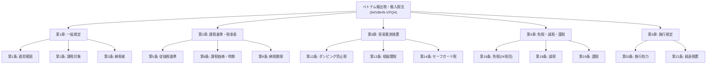
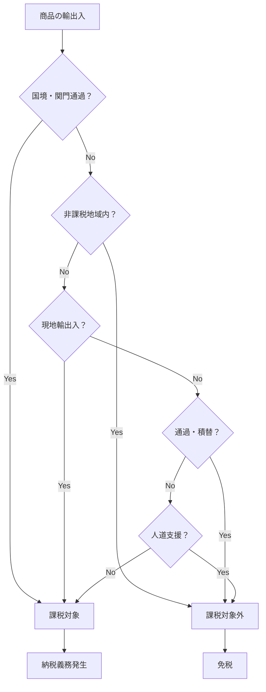
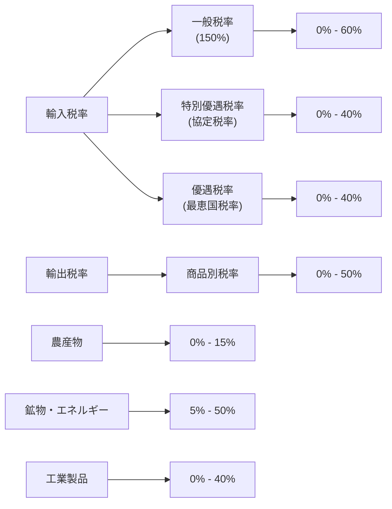
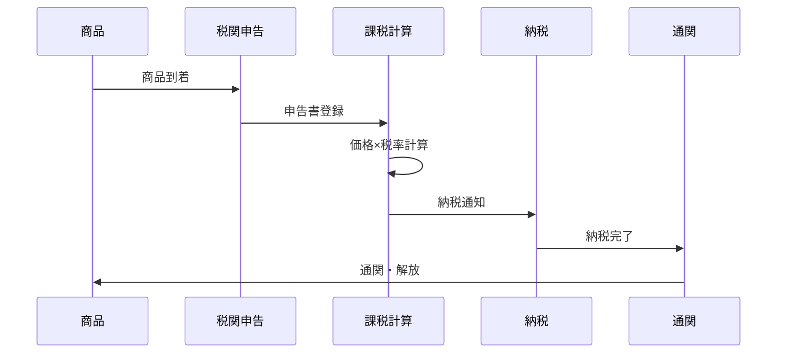
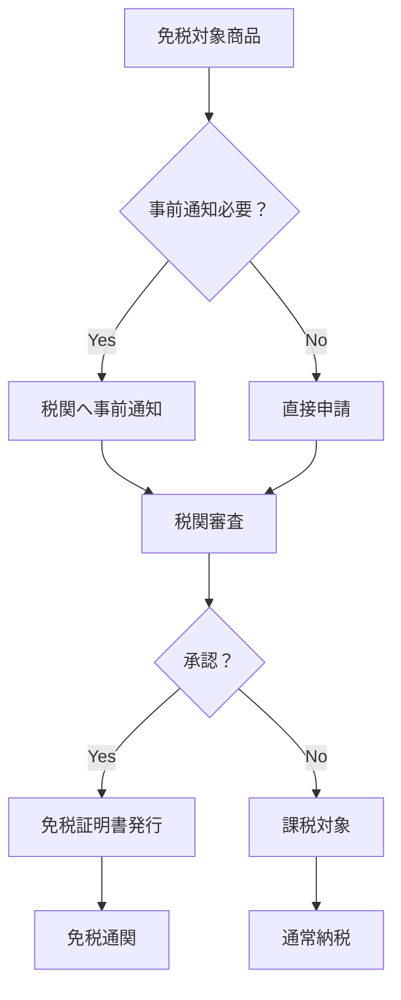
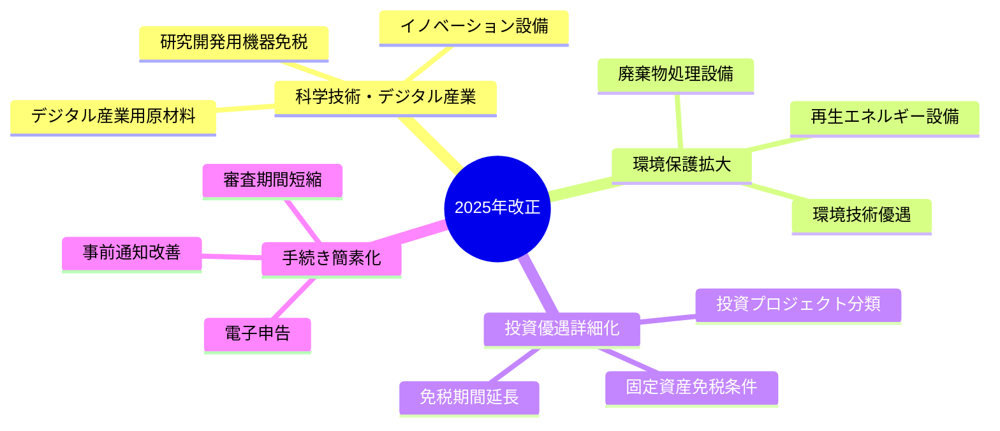

# WordPress用 Mermaid図表コード集

## 1. 法律全体構造図



## 2. 課税対象フローチャート



## 3. 税率構造図



## 4. 納税フロー図



## 5. 免税申請フロー



## 6. 2025年改正ポイント



## WordPress実装用コード

### HTML埋め込み版
```html
<div class="mermaid">
graph TD
    A[ベトナム輸出税・輸入税法] --> B[第1章: 一般規定]
    A --> C[第2章: 課税基準・税率表]
    A --> D[第3章: 貿易救済措置]
    A --> E[第4章: 免税・減税・還税]
    A --> F[第5章: 施行規定]
</div>
```

### ショートコード版
```html
[mermaid]
graph TD
    A[ベトナム輸出税・輸入税法] --> B[第1章: 一般規定]
    A --> C[第2章: 課税基準・税率表]
    A --> D[第3章: 貿易救済措置]
    A --> E[第4章: 免税・減税・還税]
    A --> F[第5章: 施行規定]
[/mermaid]
```

