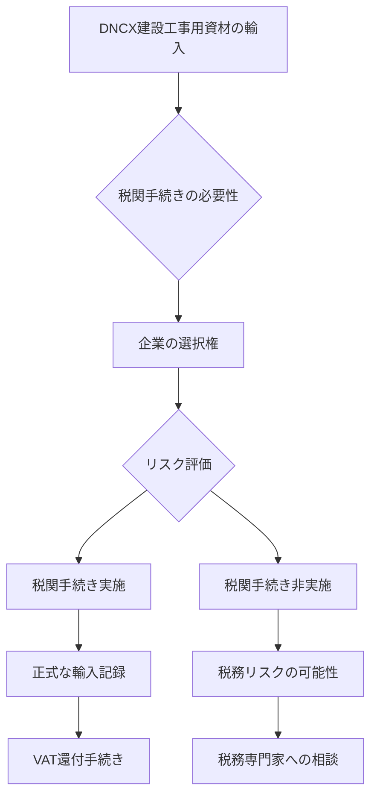

# ベトナムDNCX建設工事用資材の税関手続き完全ガイド（2024年2月税関総局回答）

こんにちは！マナラボの菅野です。

今日のテーマは「ベトナムのDNCX（輸出加工企業）で建設工事を行う際の税関手続き」についてです。

「ベトナムの工場建設で、エアコンや電気設備を輸入する時、税関手続きは必要？」

こんな疑問を持ったことがある方も多いのではないでしょうか？実際、2024年2月27日にベトナム税関総局から、この疑問に対する重要な回答が発表されたんです。

まるで「税関手続きの謎解き」が明かされたような感じですね。

でも、ちょっと待ってください。

この回答を正しく理解すれば、確かに建設工事のコスト削減や手続きの簡素化が可能になります。でも、条件を満たしていないのに「手続き不要だ！」と判断してしまうと、後で税務上の問題が発生する可能性もあるんです。

この記事を読むと、DNCXでの建設工事用資材の税関手続きの判断基準と、それを正しく活用するためのポイントが分かるようになります。また、どんな設備が対象になるのか、どのような手続きが必要なのかも詳しく説明しますよ。

実は、私もこの分野で数多くの相談を受けてきましたが、「税関手続きの判断が曖昧」で済まされない厳しい現実があります。

それでは、詳しく見ていきましょう！

## 2024年2月税関総局回答の概要

### 回答の背景

2024年2月27日、ベトナム税関総局はErnst & Young Vietnam Co., Ltd.からの質問に対して、DNCX（輸出加工企業）の建設工事用資材に関する重要な回答を発表しました。

「DNCXでの建設工事、税関手続きはどうすればいいの？」

そんな疑問に対する公式な回答がついに明らかになったんですね。

### 回答の重要性

この回答は、以下の理由で非常に重要です：

1. **公式な判断基準の明確化**：これまで曖昧だった税関手続きの判断基準が明確になりました
2. **企業の選択権の確認**：企業が税関手続きを行うかどうかを選択できる権利が確認されました
3. **VAT政策の明確化**：建設工事に対するVAT（付加価値税）の取り扱いが明確になりました

## 税関手続きに関する重要なポイント

### 1. 企業の選択権の確認

**「税関手続きは企業の選択権」**

これが今回の回答で最も重要なポイントです。

#### 法的根拠

税関総局は以下の法令を根拠として、企業の選択権を確認しました：

- **Circular No. 38/2015/TT-BTC**（2015年3月25日）
- **Circular No. 39/2018/TT-BTC**（2018年4月20日）による改正
- **Decree No. 82/2018/ND-CP**（2018年5月22日）
- **Decree No. 35/2022/ND-CP**（2022年5月28日）による代替

#### 実務的な意味

「税関手続きをするかどうかは、企業が決められる」

これは、以下のような選択肢があることを意味します：

**選択肢A：税関手続きを実施**
- メリット：正式な輸入手続きとして記録される
- デメリット：手続きコストと時間がかかる

**選択肢B：税関手続きを実施しない**
- メリット：手続きコストと時間を節約
- デメリット：税務上のリスクが生じる可能性

### 2. 建設設備の分類に関する回答

#### 税関総局の見解

**「エアコン、換気、電気、給排水、消防設備は消費財かどうか、現行法では明確な規定がない」**

これは非常に重要な回答です。

#### 実務への影響

この回答により、以下のような状況が生まれました：

**明確でない部分：**
- エアコン設備
- 換気設備
- 電気設備
- 給排水設備
- 消防設備

**税関総局の立場：**
- これらの設備の分類について、明確な法的根拠がない
- 財務省・税関総局の指導権限の範囲外

#### 企業が取るべき対応

「明確でないなら、どうすればいいの？」

この場合、企業は以下のような対応を検討する必要があります：

1. **税務専門家への相談**：個別のケースに応じた判断を求める
2. **税務当局への事前確認**：具体的な設備について事前に確認
3. **リスク評価**：税関手続きをしない場合のリスクを評価

## VAT政策に関する重要なポイント

### 1. DNCX建設工事のVAT取り扱い

#### 0% VATの適用条件

税関総局は、DNCX向け建設工事について以下のVAT政策を明確にしました：

**0% VATが適用される条件：**
- DNCX（輸出加工企業）向けの建設工事
- Circular No. 219/2013/TT-BTC第9条第2項の条件を満たす
- Circular No. 219/2013/TT-BTC第9条第3項の除外ケースに該当しない

#### 実務的な意味

「DNCX向けの建設工事なら、VATが0%になる可能性がある」

これは、建設工事のコストを大幅に削減できる可能性があることを意味します。

### 2. 税務申告と還付手続き

#### 輸出商品・サービスの税務申告

税関総局は、以下の手続きについても言及しました：

**必要な手続き：**
- 税関申告による控除・還付手続き
- Circular No. 219/2013/TT-BTC第16条第2項の規定に従った手続き

#### 実務への影響

「正しい手続きを踏めば、VATの還付が可能」

これは、建設工事のコスト削減に直結する重要な情報です。

## 実務的な対応指針

### 1. 税関手続きの判断基準

#### 判断フローチャート

#### 判断に必要な要素

**考慮すべき要素：**
1. **設備の種類**：エアコン、電気、給排水など
2. **工事の規模**：小規模 vs 大規模
3. **税務リスク**：税務当局の監視の可能性
4. **コスト**：手続きコスト vs 税務リスクコスト

### 2. VAT還付手続きのポイント

#### 手続きの流れ

**Step 1：条件確認**
- DNCX向け建設工事であることを確認
- 0% VAT適用条件を満たすことを確認

**Step 2：税関申告**
- 適切な税関申告を実施
- 必要な書類を準備

**Step 3：還付申請**
- VAT還付申請を実施
- 関連書類を提出

#### 注意点

「VAT還付は自動的には行われない」

正しい手続きを踏まないと、VAT還付を受けられない可能性があります。

## よくある質問と回答

### Q1: エアコン設備は税関手続きが必要ですか？

**A:** 税関総局の回答では、エアコン設備が消費財かどうかは明確でないとされています。企業の選択権として、税関手続きを行うかどうかを判断できます。

### Q2: DNCX向け建設工事のVATは0%になりますか？

**A:** 条件を満たせば0% VATが適用される可能性があります。具体的には、Circular No. 219/2013/TT-BTCの条件を満たし、除外ケースに該当しない場合です。

### Q3: 税関手続きをしない場合のリスクは？

**A:** 税務当局の監視を受ける可能性や、VAT還付が受けられない可能性があります。税務専門家への相談を推奨します。

### Q4: 建設工事の規模によって判断は変わりますか？

**A:** 規模の大小に関わらず、基本的な判断基準は同じです。ただし、大規模な工事の場合は税務当局の監視が厳しくなる可能性があります。

## まとめ：DNCX建設工事の税関手続き戦略

### 重要なポイントの整理

今回の税関総局回答により、以下のポイントが明確になりました：

1. **企業の選択権**：税関手続きは企業が選択できる
2. **設備分類の曖昧さ**：エアコン等の設備分類は明確でない
3. **VAT政策**：DNCX向け建設工事は0% VAT適用の可能性
4. **手続きの重要性**：正しい手続きでVAT還付が可能

### 実務的な推奨事項

**推奨する対応：**

1. **事前相談**：税務専門家に事前相談する
2. **リスク評価**：税関手続きをしない場合のリスクを評価
3. **書類整備**：適切な書類を準備・保管する
4. **継続監視**：税務当局の動向を継続的に監視

### 今後の展望

この回答により、DNCXでの建設工事に関する税関手続きの判断基準が明確になりました。ただし、税務当局の監視が厳しくなる可能性もあるため、慎重な対応が求められます。

**重要なのは、この回答を正しく理解し、自社の状況に応じた最適な判断をすることです。**

---

**関連記事：**
- [ベトナム外資企業設立完全ガイド](./ベトナム外資企業設立完全ガイド.md)
- [ベトナムIT企業向け税制優遇措置と税務当局による適用否認事例（2020～2025年）](./ベトナムIT企業向け税制優遇措置と税務当局による適用否認事例（2020～2025年）.md)

**お問い合わせ：**
DNCX建設工事の税関手続きについてご不明な点がございましたら、お気軽にご相談ください。マナボックスでは、ベトナム進出企業の税務・法務サポートを専門に行っております。
