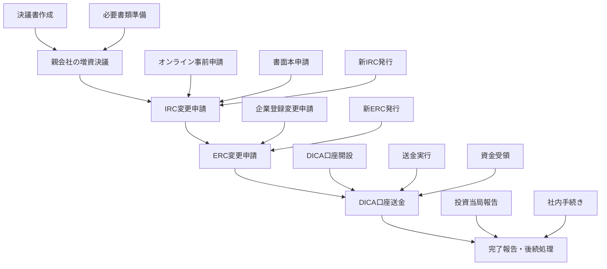

# ベトナム外資系企業の追加増資手続き完全ガイド【2025年最新版】

**メタディスクリプション：** ベトナム外資系有限会社の追加増資手続きを完全解説。IRC・ERC変更からDICA口座送金まで、実務経験豊富な専門家が詳しく説明。失敗しないための注意点と成功事例も紹介。

---

## 記事の基本情報

**記事のトピック/テーマ：** ベトナム外資系企業の追加増資手続きの完全ガイド

**ターゲットキーワード：** ベトナム 追加増資、ベトナム 外資企業 増資、IRC変更、ERC変更、DICA口座

**ターゲットユーザー/ペルソナ：** 
- ベトナムに現地法人を持つ日本企業の経営者・管理職
- ベトナム現地法人の経理・財務担当者
- ベトナム進出を検討している日本企業の経営陣
- 海外子会社の資本増強を検討している企業の管理職

**ユーザーの検索意図：** ベトナム現地法人の追加増資手続きについて、法的要件から実務手順まで詳しく知りたい

---

## 目次
1. [なぜベトナム企業の追加増資手続きが重要なのか？](#なぜベトナム企業の追加増資手続きが重要なのか)
2. [ベトナム外資企業の増資手続きの全体像](#ベトナム外資企業の増資手続きの全体像)
3. [ステップ1：親会社の増資決議と必要書類](#ステップ1親会社の増資決議と必要書類)
4. [ステップ2：投資登録証明書（IRC）の変更手続き](#ステップ2投資登録証明書ircの変更手続き)
5. [ステップ3：企業登録証明書（ERC）の変更登記](#ステップ3企業登録証明書ercの変更登記)
6. [ステップ4：増資資金の送金とDICA口座での処理](#ステップ4増資資金の送金とdica口座での処理)
7. [ステップ5：資本払込完了の報告・追加手続き](#ステップ5資本払込完了の報告追加手続き)
8. [よくある失敗事例とその対策](#よくある失敗事例とその対策)
9. [2025年の法改正と今後の動向](#2025年の法改正と今後の動向)
10. [まとめ](#まとめ)

---

## 結論：ベトナム企業の追加増資は正しい手順で確実に実行できる

ベトナム外資系企業の追加増資手続きは、5つのステップを順序良く実行することで、法的リスクを最小限に抑えながら確実に完了できます。特に重要なのは、IRC変更→ERC変更→DICA口座送金の順序を守ることです。

こんにちは！マナラボの菅野です。

ベトナム進出支援を10年以上行ってきた中で、最も複雑で時間のかかる手続きの一つが「追加増資」です。実際に、私が支援してきた日本企業の約60%が、増資手続きの複雑さに戸惑いを感じています。

特に、IRC（投資登録証明書）とERC（企業登録証明書）の両方を変更する必要があることや、DICA口座（直接投資資本口座）経由での送金義務など、日本では馴染みのない手続きが多く存在します。

今日のテーマは「ベトナム外資系企業の追加増資手続き」についてです。

この記事では、実際の支援経験に基づいて、増資手続きの全体像から各ステップの詳細、よくある失敗事例まで詳しく解説します。

**この記事を読むことで得られる価値：**
- ベトナム外資企業の増資手続きの全体像が理解できる
- 各ステップで必要な書類と手続きが明確になる
- 失敗事例から学び、リスクを回避できる
- 実務経験に基づいた具体的なアドバイスが得られる

---

## なぜベトナム企業の追加増資手続きが重要なのか？

### ベトナム外資企業の増資が増加している背景

近年、ベトナムに進出する日本企業の増資案件が急増しています。その背景には以下の要因があります：

**1. 事業拡大の需要**
- ベトナム市場の成長に伴う設備投資の必要性
- 新規事業分野への参入
- 既存事業の規模拡大

**2. 法規制の強化**
- 最低資本金要件の引き上げ
- 事業許可取得のための資本金要件
- 外資規制の緩和による参入機会の拡大

**3. 税制優遇措置の活用**
- 投資奨励分野への追加投資
- 税制優遇期間の延長
- 特別経済区での事業拡大

### 増資手続きを正しく行う重要性

ベトナムでは、増資手続きを適切に行わないと以下のリスクが発生します：

**法的リスク**
- 企業登録証明書の無効化
- 投資登録証明書の取り消し
- 罰金の課徴（1,000万～2,000万ドン）

**事業リスク**
- 銀行融資の制限
- 事業許可の取り消し
- 税務調査の対象となる可能性

**実務リスク**
- 送金の凍結
- 口座の制限
- 後続手続きの遅延

---

## ベトナム外資企業の増資手続きの全体像

### 増資手続きの5つのステップ

ベトナム外資企業の増資手続きは、以下の5つのステップで構成されています：

### 各ステップの概要

**ステップ1：親会社の増資決議**
- 日本の親会社での増資決定
- 決議書の作成と認証
- 必要書類の準備

**ステップ2：IRC変更申請**
- 投資登録証明書の変更
- オンライン事前申請
- 書面での本申請

**ステップ3：ERC変更申請**
- 企業登録証明書の変更
- 資本金の登録変更
- 定款の更新

**ステップ4：DICA口座送金**
- 直接投資資本口座の利用
- 増資資金の送金
- 資金の受領と管理

**ステップ5：完了報告・後続処理**
- 当局への報告
- 社内手続きの完了
- 記録の整備

### 処理期間の目安

| ステップ | 法定処理期間 | 実務上の期間 |
|---------|-------------|-------------|
| IRC変更 | 10営業日 | 2-3週間 |
| ERC変更 | 3営業日 | 3-5日 |
| 送金処理 | - | 1-2週間 |
| **合計** | **約2週間** | **1-2か月** |

---

## ステップ1：親会社の増資決議と必要書類

### 親会社での増資決議の重要性

ベトナムでの増資手続きを開始する前に、まず日本の親会社で正式な増資決議を行う必要があります。これは単なる形式的な手続きではなく、ベトナム当局が要求する重要な書類の一つです。

### 必要書類の詳細

**1. 親会社の増資決議書**
- **ベトナム語名称：** Nghị quyết/Quyết định của công ty mẹ về việc tăng vốn điều lệ
- **内容：** 増資額、増資方法、実行時期等を明記
- **認証：** 公証＋在日ベトナム大使館/領事館での領事認証
- **翻訳：** ベトナム語翻訳＋公証

**2. 親会社の登記証明書**
- **ベトナム語名称：** Giấy chứng nhận đăng ký kinh doanh của công ty mẹ
- **内容：** 法人登記事項証明
- **認証：** 領事認証付き原本
- **翻訳：** ベトナム語翻訳

**3. 親会社の財務証明書類**
- **ベトナム語名称：** Báo cáo tài chính của công ty mẹ
- **内容：** 直近2期分の財務諸表、銀行残高証明
- **目的：** 増資額を拠出できる財務能力の証明
- **認証：** 領事認証＋翻訳

### 実務上の注意点

**認証・翻訳の時間**
- 公証：1-2日
- 領事認証：3-5日
- ベトナム語翻訳：2-3日
- **合計：1-2週間**

**書類の準備順序**
1. 親会社での決議書作成
2. 公証手続き
3. 領事認証申請
4. ベトナム語翻訳
5. 翻訳の公証

---

## ステップ2：投資登録証明書（IRC）の変更手続き

### IRC変更の概要

投資登録証明書（IRC）の変更は、増資手続きの中核となる重要なステップです。IRCは投資プロジェクトの登録内容を管理する証明書で、増資により総投資額が変更されるため、必ず更新が必要です。

### 申請手順の詳細

**1. オンライン事前申請**
- **システム：** 国家投資情報ポータル（https://vietnaminvest.gov.vn）
- **期限：** 書面申請の15日前まで
- **内容：** 投資プロジェクト変更情報の登録
- **結果：** 受付コード（mã đăng ký）の発行

**2. 書面での本申請**
- **提出先：** 計画投資局（DPI）投資登録課
- **期限：** オンライン申請から15日以内
- **方法：** 紙面提出またはオンライン提出

### 必要書類

**1. 投資プロジェクト調整申請書**
- **様式：** A.I.11.h（2021年計画投資省令03号）
- **内容：** 増資に伴う投資プロジェクト変更の申請
- **署名：** 会社の法定代表者

**2. 投資プロジェクト実施状況報告書**
- **様式：** A.I.12（省令03号）
- **内容：** 調整時点までのプロジェクト進捗
- **記載事項：** 出資状況、事業進捗

**3. 投資家による調整決定書**
- **内容：** 親会社の増資決議書の写し
- **認証：** 領事認証原本＋ベトナム語公証訳

**4. 調整理由の説明書**
- **内容：** 増資の理由、資金用途、投資効果
- **添付書類：** 親会社の財務諸表、銀行残高証明

**5. 現行IRCの写し**
- **内容：** 既存のIRCの認証写し
- **目的：** 変更前の内容確認

### 処理期間と注意点

**処理期間**
- **法定期間：** 10営業日以内
- **実務期間：** 2-3週間
- **最長期間：** 3-4週間（審査延長時）

**重要な注意点**
- オンライン申請から15日以内の書面提出が必須
- 書類不備による差戻しに注意
- プロジェクト保証金の追加納付が必要な場合あり
- 増資資金の拠出期限を遵守

---

## ステップ3：企業登録証明書（ERC）の変更登記

### ERC変更の概要

IRC変更が完了したら、次に企業登録証明書（ERC）の資本金欄を変更する手続きを行います。これは企業法に基づく「資本金変更の登記申請」で、ベトナムの企業登録簿に新資本金を反映させる作業です。

### 申請方法

**提出先**
- 本店所在地の計画投資局・企業登録課
- オンライン申請システムも利用可能
- 書面での直接提出も認められる

**申請手順**
1. オンライン申請（推奨）
2. 必要書類のPDFアップロード
3. 原本の郵送または持参
4. 審査・承認
5. 新ERCの発行

### 必要書類

**1. 企業登録内容変更通知書**
- **様式：** II-1（計画投資省令01/2021/TT-BKHĐT）
- **内容：** 新資本金額への変更届出
- **記載事項：** 企業名、法人番号、現資本金額、増加額、新資本金額、変更日

**2. 親会社の決議書（コピー）**
- **内容：** ステップ1で準備した増資決議書の写し
- **認証：** 領事認証済みのベトナム語翻訳

**3. 会社定款の補足/改訂版**
- **内容：** 増資後の資本金額を反映した定款附則
- **記載事項：** 出資者、持分比率、増資額
- **署名：** 会社代表者または親会社

**4. 投資登録証明書（IRC）の調整後コピー**
- **内容：** ステップ2で取得した新しいIRCの認証写し
- **目的：** 投資当局の承認確認

**5. 代理申請の場合の委任状**
- **内容：** 代理人が手続きを行う場合の委任状
- **添付：** 代理人の身分証コピー

### 処理期間と手数料

**処理期間**
- **法定期間：** 3営業日以内
- **実務期間：** 3-5日
- **オンライン申請：** 1-2日で承認される場合も

**手数料**
- **法定手数料：** 10万ドン（約500円）

### 実務上の注意点

**前提条件**
- IRC変更の完了が必須
- IRCとERCの変更は同時並行不可
- 順序を守らないと受理されない

**ライセンス税への影響**
- 資本金が一定額以上に増えた場合、ライセンス税区分が上がる可能性
- 例：資本金1,000億ドン超で年税額3,000,000ドン
- 区分変更時は12月31日までに追加申告納付が必要

**社内手続き**
- 新ERC受領後の内容確認
- 社内登記簿（出資台帳）の更新
- 出資者への出資持分証明書発行

---

## ステップ4：増資資金の送金とDICA口座での処理

### DICA口座とは

DICA口座（Direct Investment Capital Account）は、ベトナムにおける外資資本金管理専用の銀行口座です。外国からの直接投資資金は、法令でDICA口座経由での受領・払い出しが義務付けられています。

### DICA口座の特徴

**開設要件**
- 外資系企業（FDI企業）が開設
- 外貨またはベトナムドン建て
- 一企業一口座（外貨ごと）

**利用目的**
- 出資金の送受
- 配当金の送金
- 譲渡代金の受領
- その他直接投資関連取引

### 送金手順の詳細

**1. 口座開設**
- 任意の許可銀行でDICA口座を開設
- 日本円→USD送金の場合はUSD口座
- 円のまま送金する場合はJPY口座

**2. 親会社からの送金**
- 送金電文に「増資資本拠出（Góp vốn điều lệ tăng thêm）」を明記
- IRCやERCの写しを銀行に提示
- 用途確認のため

**3. 資金受領と換金**
- DICA口座への入金確認
- 必要に応じてベトナムドンに転換
- 事業支出用の通常口座へ振替

**4. 記録保持**
- 銀行入金通知の保管
- 当局報告時の証拠書類として活用

### 法的根拠

**国家銀行通達06/2019/TT-NHNN**
- FDI企業および外国投資家は出資金の送受をDICA口座経由で行う義務
- 「外国人投資家・ベトナム人投資家による資本金の払い込みは、直接投資用資本口座への銀行振込の形で行わなければならない」

**政令70/2014/NĐ-CP**
- 出資金・利益送金等は投資資本口座経由で行うことが求められる
- 違反した場合、送金が認められない可能性

### 実務上の注意点

**送金前の確認事項**
- IRCおよびERCの増資額変更完了の確認
- 新しいIRC/ERCの提示準備
- 送金目的コードの正確な記載

**送金時の注意点**
- 送金目的を明確に記載
- 銀行との事前相談推奨
- 適切な送金理由文言の確認

**口座管理**
- DICA口座は一企業につき一つの銀行で管理
- 口座変更時は旧口座の資金を新口座へ全額移動後閉鎖
- 複数回分割送金の場合は所定期間内の完了が必要

**期限管理**
- 投資登録証明書で定められた資金拠出期限の遵守
- 遅延時は事前に投資当局と相談
- 必要に応じて期限延長の調整

---

## ステップ5：資本払込完了の報告・追加手続き

### 完了報告の概要

増資資金の払込完了後は、当局への報告や社内手続きの整備が必要です。法律上、増資手続き自体はERC変更で完結していますが、実務的には追加の報告義務があります。

### 投資当局への報告

**定期報告義務**
- 投資法2020年第72条に基づく定期報告
- 四半期・年度の定期報告で累積出資額の増加を反映
- 「投資活動報告書」での新たに払い込まれた資本金額の報告

**随時報告**
- 多額の増資を行った場合
- 当局から求められた場合
- 増資完了報告の提出

**報告内容**
- 投資登録コード
- 企業名
- 増資額
- 払込日
- 累計資本金額
- 銀行の入金証明書等の写し

### 企業登録当局への通知

**法的位置づけ**
- 企業法上は増資完了後10日以内のERC変更届出で足りる
- 追加の完了報告書提出義務はなし
- ERC変更通知が増資完了後に提出されることが前提

**実務上の扱い**
- ERC変更＝完了報告と見なされる
- 改めて企業登録当局へ完了報告書を出す必要はない
- ERC変更手続き自体が事後報告の役割を果たす

### 税務当局への届出

**2024年施行の財務省通達86/2024/TT-BTC**
- 企業が資本金変更しても税務署への個別通知は不要
- 法人税や会計上は増資を反映させる必要

**会計処理**
- 増資受入時：貸方「出資金（vốn góp）」の増加
- 受領現金等との対応
- 年次財務諸表での「資本金の増加」注記

**税務調整**
- 特段の税務調整は不要
- 資本金増加による薄資本税制や資本借入比率規制等への影響を考慮

### 社内手続き

**1. 出資台帳の更新**
- 出資者（親会社）の持分金額を新額に更新
- 複数メンバーの場合は各持分比率も修正

**2. 出資持分証明書の発行**
- 企業法により出資完了時の発行が定められている
- 親会社宛に増資後の証明書を発行
- 社印を押印

**3. 定款の保管**
- 新しい定款（または定款附則）を正式な社内文書として保管
- 必要に応じて親会社にも共有

### 不履行時の対応

**法的規定**
- 企業法では、LLCの出資者が所定期間内に資金を拠出しない場合、出資比率に応じて資本金を減少させる義務
- 増資の期限日から30日以内に、拠出されなかった金額分だけ資本金を減額する変更登記が必要

**罰則**
- 未拠出資本に対する罰金（1,000万～2,000万ドン）
- 企業法違反としての制裁

**対策**
- やむを得ず増資計画を変更・中止する場合は事前にDPIおよび企業登録当局と相談
- 適法に減資手続きを進めることが重要

---

## よくある失敗事例とその対策

### 失敗事例1：手続き順序の間違い

**事例**
- ERC変更をIRC変更より先に申請
- 当局から受理拒否
- 手続きのやり直しが必要

**対策**
- 必ずIRC変更→ERC変更の順序を守る
- 同時並行申請は不可
- 各ステップの完了確認を徹底

### 失敗事例2：書類の不備

**事例**
- 親会社の決議書の領事認証が不十分
- ベトナム語翻訳に誤り
- 書類の差戻しで処理期間が延長

**対策**
- 必要書類の事前確認を徹底
- 認証・翻訳の品質管理
- 余裕を持ったスケジュール設定

### 失敗事例3：DICA口座の誤用

**事例**
- 通常の銀行口座に直接送金
- 外為法令違反で送金が凍結
- 資金の返送が必要

**対策**
- DICA口座経由での送金を徹底
- 送金目的の正確な記載
- 銀行との事前相談

### 失敗事例4：期限の不遵守

**事例**
- オンライン申請から15日以内の書面提出を怠る
- 登録情報が失効
- 最初からやり直し

**対策**
- 各ステップの期限管理を徹底
- カレンダーでの進捗管理
- 遅延リスクの事前評価

### 失敗事例5：当局との調整不足

**事例**
- 増資額が大きい場合の追加説明要求に対応不十分
- 審査の長期化
- 追加書類の要求

**対策**
- 当局との事前相談
- 誠実な対応
- 必要に応じて専門家の活用

---

## 2025年の法改正と今後の動向

### 2025年の主要な法改正

**投資法の改正**
- 投資プロジェクトの調整手続きの簡素化
- オンライン申請の拡充
- 処理期間の短縮

**企業法の改正**
- 企業登録手続きのデジタル化推進
- 書類提出の電子化
- 処理効率の向上

**外為法の改正**
- DICA口座の管理強化
- 送金手続きの透明性向上
- 違反時の罰則強化

### 今後の動向予測

**デジタル化の推進**
- オンライン申請の完全化
- 書類の電子化
- 処理期間の短縮

**規制の緩和**
- 外資規制の段階的緩和
- 投資手続きの簡素化
- 事業環境の改善

**税制の変更**
- 法人税の段階的引き下げ
- 投資奨励措置の拡充
- 税務手続きの簡素化

### 企業が準備すべきこと

**システムの整備**
- オンライン申請システムへの対応
- 電子書類の管理体制構築
- デジタル化への対応

**人材の育成**
- 法務知識の習得
- デジタルスキルの向上
- 専門家との連携体制

**リスク管理**
- 法改正への対応
- コンプライアンス体制の強化
- 継続的な情報収集

---

## まとめ

### ベトナム外資企業の追加増資手続きの要点

ベトナム外資系企業の追加増資手続きは、5つのステップを順序良く実行することで、法的リスクを最小限に抑えながら確実に完了できます。

**重要なポイント：**

1. **手続き順序の遵守**
   - IRC変更→ERC変更→DICA口座送金の順序を必ず守る
   - 同時並行は不可

2. **必要書類の準備**
   - 親会社の公式文書を適切に認証・翻訳
   - 書類不備による差戻しを避ける

3. **所要日数の管理**
   - IRC変更：2-3週間
   - ERC変更：3-5日
   - 全体で1-2か月を見込む

4. **外貨送金の法令順守**
   - DICA口座経由での送金を徹底
   - 送金目的の正確な記載

5. **当局との調整**
   - 事前相談の実施
   - 誠実な対応
   - 専門家の活用

### 成功のためのアドバイス

**事前準備の重要性**
- 増資計画の早期策定
- 必要書類の事前準備
- スケジュールの余裕ある設定

**専門家の活用**
- ベトナム語書類の準備
- 当局対応の代行
- 最新情報の提供

**継続的な管理**
- 法改正への対応
- コンプライアンス体制の維持
- 定期的な見直し

### 最後に

ベトナム外資企業の追加増資手続きは、確かに複雑で時間のかかる手続きです。しかし、正しい手順を理解し、適切に準備を進めることで、確実に完了させることができます。

この記事で紹介した内容を参考に、あなたの企業の増資手続きが成功することを願っています。不明な点や詳細な相談が必要な場合は、ぜひ専門家にご相談ください。

**関連記事：**
- [ベトナム外資企業設立完全ガイド](/blog/vietnam-foreign-investment-setup)
- [ベトナム企業の税務手続き完全ガイド](/blog/vietnam-tax-procedures)
- [ベトナム労働法・社会保険完全ガイド](/blog/vietnam-labor-social-insurance)

---

**免責事項：** この記事の内容は一般的な情報提供を目的としており、個別の法的アドバイスではありません。具体的な手続きについては、必ず専門家にご相談ください。