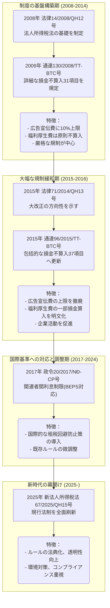

# ベトナム法人税「損金不算入費用」の変遷完全ガイド（2008年～2025年）

こんにちは！マナラボの菅野です。

今日は、ベトナムで事業をしている日本企業の経営者から、こんな相談をいただきました。

「ベトナムの損金不算入って、昔と今で全然違うって聞いたんですが、実際のところどうなんですか？うちの会社、昔のルールで計算してるんですが大丈夫でしょうか？」

**実は、この相談、めちゃくちゃ多いんです。**

ベトナムの損金不算入制度は、2008年から2025年までに**4回の大きな改正**を経て、その姿を大きく変えてきました。特に2015年の改正は「税制の大転換」と言われるほど大きな変化だったんです。

「えっ、4回も変わってるなんて知らなかった...！じゃあ、昔の常識はもう通用しないってこと？」

そうなんです。過去のルールを引きずっていると、**知らないうちに損をしてしまったり、税務上のリスクを抱えてしまう**可能性もあるんですよ。

**この記事を読むと、ベトナムの損金不算入制度の変遷がスッキリ理解できて、日本企業がどう対応すべきかがバッチリわかります。**

正直、法律の話なので少し難しい部分もあるんですが、なるべくわかりやすく、実際のビジネスで役立つように説明していきますね。肩の力を抜いて、気楽に読み進めてくださいね！

## 【年表】ベトナム損金不算入制度の主要な法令と変遷（2008年～2025年）

「損金不算入って、いつから始まったの？どんな法律で決まってるの？」

こんな質問もよくいただくんです。過去の法令の移り変わりを見ると、ベトナムの税制がどう変化してきたかがよく分かりますよ。

まず、過去約17年間の損金不算入制度に関する主要な法律、政令、通達の変遷を時系列で見てみましょう。

| 発効年月日（施行日） | 法令番号・名称 | 主な内容（損金不算入制度に関するポイント） | 2025年時点での状況 |
| :--- | :--- | :--- | :--- |
| 2009年1月1日 | 法律第14/2008/QH12号 | 現代的な法人所得税法の基礎を構築。損金算入の基本要件を定義。 | 新法（67/2025/QH15号）施行に伴い**失効** |
| 2009年1月1日 | 政令第124/2008/NĐ-CP号 | 損金不算入項目を具体化。広告宣伝費の上限（売上の10%）などを規定。 | 新法とその下位法令に代替され**失効** |
| 2009年1月1日 | 通達第130/2008/TT-BTC号 | 全31項目の詳細な損金不算入リストを提示。 | 新法とその下位法令に代替され**失効** |
| 2015年1月1日 | 法律第71/2014/QH13号 | **広告宣伝費の上限を撤廃**。福利厚生費の一部損金算入を容認。 | 新法（67/2025/QH15号）施行に伴い**失効** |
| 2015年8月6日 | 通達第96/2015/TT-BTC号 | 改正を反映した包括的な損金不算入リスト（37項目）を提示。 | 2025年9月末をもって**失効** |
| 2017年5月1日 | 政令第20/2017/NĐ-CP号 | 関連者間の支払利息費用に損金算入制限（EBITDAの20%）を導入。 | 内容は後継の政令に引き継がれ、本法令自体は**失効** |
| 2018年5月1日 | 通達第25/2018/TT-BTC号 | 従業員向け任意保険料の損金算入上限を月額300万ドンに引き上げ。 | **現在有効**（2025年10月1日以降は新法施行に伴い失効予定） |
| 2025年10月1日 | 法律第67/2025/QH15号 | 新法人所得税法。損金不算入費用の範囲と条件を法典化・見直し。 | **現行法**として施行 |

---

## 第1期：制度の基盤構築（2008年～2014年）- 通達130号の時代

「2008年って、まだベトナムの税制が整ってなかった時代ですよね？」

その通りです。2009年1月1日に施行された2008年法人所得税法（14/2008/QH12号）は、ベトナムの法人税制の基礎を築いた、まさに「税制の黎明期」の法律なんです。

この法律と、その施行細則を定めた通達130/2008/TT-BTCでは、損金算入が認められるための基本ルール（事業に関連しているか、証憑があるか）を定めると同時に、**31項目にわたる詳細な損金不算入費用のリスト**が規定されました。

「31項目って、結構多いですね...正直、全部把握するのは大変そう！」

そうなんです。この時期の制度は、企業の経費支出に対して**かなり厳格な制限**を課していました。まさに「税務の専門家じゃないと大変だなぁ」と感じるような時代でしたね。

### 主な損金不算入項目（通達130号に基づく）

この時期の損金不算入項目を詳しく見ていきましょう。特に企業経営に大きな影響を与えた項目を中心に、皆さんが「これってどうなの？」と感じるようなポイントに絞って説明しますね。

#### 1. 広告宣伝費等の上限規制 - 企業の最大の悩みの種

「広告宣伝費に上限があるって、本当ですか？ビジネスの成長に欠かせない費用なのに...」

はい、これが当時の企業にとって**最大の悩みの種**でした。マーケティングに力を入れたい企業にとっては、本当に頭の痛い問題でしたね。

広告、マーケティング、接待交際費などについて、年間総損金算入費用の**10%**（新規設立後3年間は15%）を超える部分は損金不算入とされていました。

**具体例で見てみましょう：**
- 年間売上が100億ドンの会社の場合
- 広告宣伝費が15億ドンかかったとします
- 損金算入できるのは10億ドンまで、つまり売上の10%分だけ。
- 残りの5億ドンは、残念ながら損金不算入。その分だけ法人税が増えてしまうんです。

「えっ、それって結構な金額ですよね？ビジネスチャンスを逃しかねない...」

そうなんです。特にマーケティング重視の企業にとっては、**実質的な税負担が大幅に増加**してしまう、かなり厳しい制度でした。

#### 2. 人件費関連 - 給与の支払いルールが厳格

人件費についても、当時からかなり厳格なルールがあったんですよ。

- **実際に支払われていない給与**：帳簿上は計上しても、まだ支払っていない給与は損金にできないんです。
- **労働契約に定めのない賞与**：契約書に「賞与を出すよ」と明記されていないと、残念ながら損金算入は認められませんでした。
- **特定の役員への給与**：例えば、過度に高い役員報酬の一部は、税務上「不適切」と見なされて損金不算入になるケースもありました。

「賞与も契約書に書いてないとダメなんですか？なんか、ちょっと融通が利かない感じですね...」

はい、当時はそうでしたね。ベトナムの労働法では賞与の支給が義務付けられていませんが、税務上は**契約書に明記されていない賞与は損金不算入**という、かなり厳格な運用だったんです。これも、経営者の方々にとっては悩ましい点だったかもしれません。

#### 3. 固定資産の減価償却費 - 過剰償却の防止

固定資産の減価償却についても、当時から「やりすぎはダメよ」という厳格な制限があったんです。

- **法定耐用年数を超える過剰償却費**：法律で定められた年数よりも短い期間で償却しようとすると、その「やりすぎた分」は損金不算入になってしまいました。
- **高額乗用車の償却費制限**：特に高額な乗用車（資産価値16億ドン、日本円で約1,000万円超）については、その償却費の一部が損金に算入できないというルールもありました。当時のベトナムでは、これだけの高級車は「贅沢品」と見なされていたんですね。

「16億ドンって、日本円でいくらですか？結構な金額の車ですよね...」

そうなんです、約1,000万円ですね。高級車の購入にも税務上の制約があったわけです。これも、企業としては頭を悩ませるポイントでした。

#### 4. 福利厚生費 - 従業員の待遇改善が困難

従業員向けの福利厚生費についても、当時は「事業に直接関係ないでしょ？」と見なされがちで、なかなか損金算入が認められなかったんです。従業員のモチベーションを上げたい企業にとっては、ジレンマでしたね。

- **慶弔見舞金**：従業員の結婚、出産、葬儀などへのお祝いやお見舞い
- **レクリエーション費用**：社員旅行や忘年会といった、従業員のリフレッシュのための費用
- **その他の福利厚生費**：健康診断や研修費用など、従業員の健康やスキルアップに関わる費用

これらは、原則として**事業に直接関連しない費用**と見なされ、損金算入が非常に困難でした。つまり、会社が従業員のために使ったお金でも、税務上は「認めません」というスタンスだったんです。

「従業員のモチベーション向上には福利厚生が重要なんですが...これだと、なかなか踏み切れませんよね？」

そうなんです。この制度の下では、従業員の待遇改善を図ろうとしても、**税務上の制約**で思うようにいかない企業が多かったんです。せっかく従業員のために、と思っても、税金が増えてしまうのは避けたいですものね。

#### 5. 借入利息の制限 - 高金利借入の制限

金融機関以外からお金を借りる場合の利息についても、制限がありました。

- **ベトナム国家銀行の基本金利の150%を超える部分**は損金不算入とされていました。簡単に言えば、「あまりにも高い金利で借りすぎると、税金計算上は認めませんよ」ということですね。

「150%って、結構高い金利ですよね？なんでこんな制限があったんですか？」

はい、当時のベトナムでは、民間からの借入金利が非常に高いケースもありました。この制限は、**過度な金利負担による利益圧縮を防ぎ、企業の健全な経営を促す**目的もあったと言われています。でも、企業側からすれば、資金調達の選択肢が狭まってしまうと感じることもあったかもしれませんね。

### この時期の制度の特徴

この時期の規制は、企業の経費支出に対して**比較的厳格な制限**を課すものであり、特に広告宣伝費の上限は多くの企業の悩みの種となっていました。まさに「ガチガチにルールが固められていた」という印象ですよね。

「でも、なぜこんなに厳格だったんですか？もっと企業を自由にさせてくれればいいのに...」

そう思われる気持ち、よく分かります。当時のベトナム政府は、**税収の確保**と**企業の適正な経営**を非常に重視していました。特に、まだ経済が発展途上だったこともあり、**外資企業の「過度な経費計上」を防ぎ、公平な課税を徹底する**という目的もあったと言われています。企業としては大変なことも多かったでしょうが、これもベトナム経済が成長していくための「産みの苦しみ」だったのかもしれませんね。

---

## 第2期：大幅な規制緩和（2015年～2016年）- 通達96号の時代

「2015年って、何か特別な年だったんですか？税制が大きく変わったって聞きましたけど...」

はい、2015年は、ベトナムの法人税制にとって**歴史的な転換点**となった年なんです。まさに「税制のパラダイムシフト」が起きたと言っても過言ではありません！

2014年末に公布された税法改正法（71/2014/QH13号）と、それを受けて発行された通達96/2015/TT-BTCにより、損金不算入制度は**劇的に緩和**されました。「え、そんなに？」と思うくらい、大きく変わったんですよ。

「劇的にって、どのくらい変わったんですか？どんなメリットがあったのか気になります！」

この改革の核心は、**企業の経済活動を促進するための規制緩和**でした。これまで企業の足かせとなっていた多くの制限が、この時期に一気に撤廃されたんです。まさに「企業活動の自由度が爆上がり！」という感じですね。

### 2015年改正の主要ポイント

この改正で、企業経営に大きな影響を与えた3つの重要な変更がありました。まさに「企業が待ち望んでいた変化」と言えるでしょう。

#### 1. 広告宣伝費の上限撤廃 - 企業の最大の悩みが解決！

「広告宣伝費の上限が撤廃されたって、本当ですか？これまでの悩みが一気に解決するじゃないですか！」

はい、これが**最も画期的な変更**でした！当時の企業担当者の方々は、このニュースに歓喜したと聞いていますよ。

企業活動の足かせとなっていた広告宣伝費等の10%上限が**完全に撤廃**されました。これにより、企業は事業戦略に基づき、必要なマーケティング費用を金額の制限なく損金算入できるようになったんです。まるで「鎖が解き放たれた」ような気分だったでしょうね。

**具体例で見てみましょう：**
- 年間売上が100億ドンの会社の場合
- 広告宣伝費が20億ドンかかったとします
- **以前**：損金算入できるのは10億ドンまで（残り10億ドンは損金不算入で、税金が増えていました...）
- **改正後**：20億ドンすべて損金算入可能！税金が増える心配がなくなりました！

「それって、税負担が大幅に減りますよね？新しいプロモーションもバンバン打てそう！」

そうなんです！特にマーケティング重視の企業にとっては、**実質的な税負担が大幅に軽減**されました。これで、もっと自由にビジネスを展開できるようになったわけですね。企業の成長エンジンに火が付いた瞬間です！

#### 2. 福利厚生費の損金算入枠の明文化 - 従業員の待遇改善が可能に！

従業員やそのご家族のための福利厚生費についても、ガラッと変わったんですよ！

- **年間の実績給与総額の平均1ヶ月分**を上限として、損金算入が明確に認められるようになりました。「これまで認められなかったものが、ちゃんと経費にできるようになった！」というのは、本当に大きかったですね。

**具体例で見てみましょう：**
- 年間給与総額が12億ドンの会社の場合
- 平均1ヶ月分は1億ドンです。
- この1億ドン分の福利厚生費（慶弔見舞金、社員旅行費、健康診断費用など）が、バッチリ損金算入できるようになったんです。

「これって、従業員のモチベーション向上に大きく貢献しますね？会社として、もっと従業員を大切にできるようになったわけだ！」

はい、まさにその通りです！これは**従業員の待遇改善を税務面から後押しする重要な改正**でした。これまで「税務上の制約で...」と諦めていた福利厚生の充実が、この改正で実現できるようになったんです。従業員の皆さんも喜んだことでしょうね！

#### 3. 従業員向け任意保険料の損金算入 - 従業員の保障向上！

企業が負担する生命保険料や任意年金掛金についても、損金算入が認められるようになりました。これは「従業員の安心」につながる、嬉しい改正でしたね！

- **従業員一人当たり月額100万ドン**を上限に損金算入が認められました。もし従業員が10人いれば、月に1,000万ドン（約6万円）まで、会社が保険料を払っても税金計算上、ちゃんと経費にできるようになったんです。

「100万ドンって、日本円でいくらですか？当時としては結構大きな金額ですよね？」

そうなんです、約6,000円です。当時のベトナムでは、これだけの金額で従業員の生命保険や年金に加入できるようになったんです。会社の福利厚生として、従業員の保障を厚くできるようになったのは、本当に素晴らしい変化でしたね。

### この改正の影響 - 「企業活動の自由度が爆上がり！」

この2015年の改正により、損金不算入費用の範囲は**大きく縮小・限定化**され、企業の税務戦略の自由度は格段に向上しました。まるで「手かせ足かせが外れた」ように、企業が自由に動けるようになったイメージです。

通達96号は、この新しい枠組みを反映した**37項目の損金不算入リスト**を提示し、その後の制度の基礎となりました。

「37項目って、31項目から増えてるんですね？なんか、また増えてるって聞くとちょっと不安...」

そう思われる気持ち、よく分かります。でもご安心ください！項目数は増えましたが、**内容は大幅に緩和**されました。新たに追加された項目の多くは、より具体的で限定的なもので、むしろ「これまで曖昧だったルールが明確になった」というポジティブな側面が大きかったんですよ。シンプルに言えば、**企業にとって有利な方向への「詳細化」**だったんです。

### 企業経営への実際の影響 - 「ベトナムビジネス、攻めの時代へ」

「実際に、この改正で企業の経営はどう変わったんですか？攻めの経営ができるようになったってことですか？」

まさにその通りです！多くの企業で以下のようなポジティブな変化が見られました：

- **マーケティング予算の大幅増加**：広告宣伝費の上限撤廃により、これまで以上に積極的なマーケティング投資が可能になりました。新しい商品やサービスをどんどん市場に投入できるようになったんです。
- **従業員の待遇改善**：福利厚生費の損金算入により、従業員のモチベーション向上や優秀な人材の確保につながりました。会社が従業員を大切にできるようになったのは、本当に良いことですよね。
- **税務コンプライアンスの簡素化**：制限の緩和により、税務処理がより柔軟になり、企業担当者の負担も軽減されました。

「でも、税収は減らなかったんですか？政府としては、ちょっと困っちゃうんじゃ...」

そう思われますよね。でも実は、この改正は**税収の減少よりも企業活動の促進**を重視した政策でした。結果として、企業の成長が加速し、経済全体が活性化したことで、**結果的に税収も増加した**という報告もあるんですよ。「攻めの税制改革」が功を奏した形ですね。

---

## 第3期：国際基準への対応と微調整（2017年～2024年）

「2015年の大改正の後は、どうなったんですか？もうこれで税制は安定したのかな？」

いえいえ、税制は生き物ですから、常に変化し続けるんですよ！2015年の大改正後、ベトナムの損金不算入制度は、**国際的な租税回避防止の動き**（BEPSプロジェクトなど）への対応と、国内経済の実態に合わせた微調整の段階に入りました。

「BEPSプロジェクトって何ですか？なんだか難しそうな言葉が出てきましたね...」

そう思われますよね。BEPS（Base Erosion and Profit Shifting）は、ものすごく簡単に言うと、**多国籍企業が税金のかからないように利益を移動させちゃうのを防ぐための国際的なルール作り**のことなんです。世界中の国が「ずる賢い税金逃れは許さないぞ！」と協力し始めたわけですね。ベトナムもこの動きに合わせて、税制を調整していったんですよ。

### この時期の主な改正点

この時期には、大きく分けて2つの重要な改正がありました。国際的な流れに合わせた「調整」が中心でしたね。

#### 1. 関連者間利息費用の損金算入制限導入（2017年）- 「身内への高金利はダメよ」ルール

「関連者間の利息って、何ですか？親子会社の間のお金のことですか？」

はい、まさにその通りです！これは、**親会社と子会社の間での借入金の利息**など、グループ会社内でのやり取りを指します。多国籍企業の中には、税金が安い国にある関連会社に高金利で貸し付けて、利益を税金のかからない国に移動させようとするケースがあったんです。これを防ぐためのルールですね。

政令20/2017/NĐ-CP号により、関連当事者への純支払利息費用について、損金算入額が**EBITDA（税引前利益＋支払利息＋減価償却費）の20%**に制限されました。「EBITDA」という難しい言葉が出てきましたが、シンプルに言えば、**「事業で稼いだ利益の一定割合以上は、身内への利息として経費にできませんよ」**というルールです。

「EBITDAの20%って、どのくらいの金額ですか？うちの会社だとどうなりますか？」

**具体例で見てみましょう：**
- EBITDAが100億ドンの会社の場合
- 関連者間の利息費用が30億ドンあったとします
- 損金算入できるのは20億ドンまで（EBITDAの20%）
- 残りの10億ドンは、損金不算入になってしまいます。

「でも、その後30%に緩和されたんですね？やっぱり、ちょっと厳しすぎたんでしょうか？」

はい、政令132/2020/ND-CP号により、上限が30%に緩和されました。これは、**企業の実情に配慮した調整**だったんです。国際的な基準と企業の活動のバランスを取ろうとした、ということですね。

#### 2. 従業員向け保険料の限度額引き上げ（2018年）- 従業員の保障がさらに手厚く！

通達25/2018/TT-BTC号により、従業員向けの任意保険料・年金掛金の損金算入上限が、月額100万ドンから**300万ドン**へと、なんと**3倍**も大幅に引き上げられました！これは、会社として従業員への保障をさらに手厚くできるようになった、ということですね。

「300万ドンって、日本円でいくらですか？結構、大きな保障ができますね！」

そうなんです、約18,000円です。もし従業員が10人いれば、月に3,000万ドン（約18万円）まで、会社が保険料を払っても税金計算上、ちゃんと経費にできるようになったんです。従業員の皆さんも、より安心して働けるようになったのではないでしょうか。

### 現在の状況 - 新法への橋渡し

**重要ポイント：** この通達25/2018/TT-BTC号は、実は**2025年10月1日の新法人所得税法施行までは有効**なんです。つまり、今現在も、従業員向け任意保険料の月額300万ドン上限が適用されているということですね。

ただし、新法の施行に伴い、この通達もその役目を終える予定です。「2025年10月1日って、もうすぐですね？新しい法律ではどうなるんですか？」

はい、その通りです。新法の施行により、これまでの政令や通達が整理され、より体系的な制度へと進化します。まさに「次の時代への橋渡し」という位置づけですね。

---

## 第4期：新時代の幕開け（2025年～）- 新法人所得税法（67/2025/QH15号）

「2025年10月1日から、また新しい法律が始まるんですね？今度はどんな変化があるんでしょうか？」

はい、2025年10月1日、ベトナム税制は**新たな時代を迎えます**！まさに「新時代の幕開け」という感じで、私たちも注目しています。

2025年6月に可決された新法人所得税法（67/2025/QH15号）は、これまでの2008年法およびその後の改正法を**全面的に置き換える**ものなんです。損金不算入制度についても、かなり重要な見直しが行われていますよ。

「全面的に置き換えるって、かなり大きな変化ですね！今までと全然違うルールになるってこと？」

そうなんです。新法の目的は、これまでの政令や通達レベルで規定されていたルールを**法典化**し、税制の透明性と予見可能性を高めるとともに、現代的な経済社会の要請に対応することにあります。

「法典化って、どういうことですか？なんだか難しそう...」

シンプルに言えば、これまで「いろんな場所にバラバラに書かれていた細かいルール」を、**「大きな一冊の本（法律）にまとめて、分かりやすく整理する」**ということです。これにより、企業にとってより分かりやすく、予測しやすい税制になるんですよ。まるで「税務の地図が新しくなった」ようなイメージですね。

### 新法人所得税法における主な変更点とポイント

新法では、これまでの政令や通達で規定されていたルールが、**法律レベルで体系的に整理**されました。まるで「散らばっていたピースが、大きなパズルになった」ようなイメージですね。主な変更点を詳しく見ていきましょう。

#### 1. 利息費用ルールの法典化 - より明確で分かりやすいルールに！

従来、下位法令で規定されていた金融機関以外からの借入利息の制限（民法の上限金利を参照）が、ついに**法律に明記**されました。これは、すごく大きな変化なんです！

「これって、どういう意味ですか？前と何が違うんですか？」

これまで、借入利息の制限が政令や通達でバラバラに規定されていたものが、**法律で統一的なルール**として定められたということです。これにより、企業にとってより分かりやすく、予測しやすい税制になりました。何がOKで何がNGか、一目瞭然になったわけですね！

#### 2. 法令違反費用の不算入明確化 - 「悪いことはダメよ」がより明確に！

環境保護法や広告法など、他の法令に違反する活動から生じた費用は、損金に算入できないことが**明確化**されました。シンプルに言えば、**「社会のルールを守らないで発生した費用は、税金計算上、経費として認めませんよ」**というメッセージが、よりハッキリしたんです。

「法令違反の費用って、具体的にはどんなものがありますか？うっかり違反しちゃわないか心配...」

そうですよね、気になりますよね。例えばこんなケースが考えられます：
- **環境保護法に違反して排出した廃棄物の処理費用**：環境を汚してしまった分の後始末にかかる費用ですね。
- **広告法に違反した不適切な広告の制作費用**：嘘や誇張があった広告などです。
- **労働法に違反した残業代の支払い**：従業員を不当に働かせた場合の費用などですね。

これらは、企業に**コンプライアンス（法令遵守）をより強く意識させる**ための規定です。社会的な責任を果たすことが、税務上も有利になる、という考え方が浸透してきた証拠ですね。

#### 3. 環境・社会関連投資の優遇 - 地球にもお財布にも優しい税制へ！

カーボンクレジット取引から生じる所得の非課税化など、環境対策に関連する費用支出を損金算入可能費用として明確化する規定が盛り込まれました。これは、**「環境に優しい取り組みをすれば、税務上も優遇しますよ」**という、ベトナム政府からの明確なメッセージなんです！

「カーボンクレジットって、何ですか？ちょっと専門的すぎてピンとこないかも...」

そうですよね、初めて聞く方も多いかもしれません。カーボンクレジットは、ものすごく簡単に言うと、**「二酸化炭素の排出量を減らした分を、『権利』として売買できる仕組み」**のことです。例えば、自社で省エネ設備を導入してCO2排出量を減らしたら、その減らした分を「クレジット」として他の会社に売れる、というイメージですね。

この制度により、環境対策に積極的な企業は**税務面でも優遇**されるようになりました。地球環境を守りながら、企業の負担も軽減できる、まさに一石二鳥の制度ですね！

#### 4. 寄附金の対象範囲拡大 - 会社が社会貢献しやすくなった！

従来の教育、医療、災害などに加え、**科学技術研究への寄附**なども損金算入の対象となる可能性があります。「会社が社会のために使うお金」が、より広く認められるようになった、ということですね。

「科学技術研究への寄附も対象になるんですね？イノベーションを後押しする感じでしょうか？」

はい、まさにその通りです！これは**ベトナムの技術革新を促進する**ための政策です。企業が大学や研究機関への寄附を行うことで、税務面でもメリットが得られるようになりました。会社として社会貢献もしやすくなった、という、とても良い変化だと思います。

## まとめ：17年間の変遷を振り返って、未来へ一歩踏み出そう！

長い話になりましたが、ベトナムの損金不算入制度の歴史と、これからの変化についてお話ししてきました。ここまで読んでくださり、本当にありがとうございます！

今回お話ししたベトナムの損金不算入制度の変遷、どう感じましたか？

「思っていたより複雑で、時代とともに大きく変わってるんですね...。正直、ついていくのが大変そうだな、という不安も感じました。」

そう思われる気持ち、よく分かります。税制って、本当に奥が深くて、常に最新情報をキャッチアップするのが難しいですよね。でも、ご安心ください！

### 制度の本質：時代に合わせた進化 - 「未来志向の税制へ」

ベトナムの損金不算入制度は、2008年以降、**「厳格な制限」から「経済活動を促進する緩和」、そして「国際基準とコンプライアンスを重視した適正化」**へと、その姿を大きく変えてきました。

特に2015年の広告宣伝費上限の撤廃と福利厚生費の損金算入容認は、企業経営に大きな影響を与えた**画期的な改正**でした。これで、企業が自由に、そして積極的にビジネスを展開できるようになったんです。

そして2025年の新法は、これまでの流れを制度的に定着させ、環境問題など新たな課題に対応する、より現代的で精緻な税制への移行を示すものと言えます。まさに「未来志向の税制」へと進化している最中なんですね。

### 実務上のアドバイス - 「完璧じゃなくても大丈夫！」

「こんなに複雑な税制、私に全部理解できるかな...」と不安に感じる方もいるかもしれませんね。でも大丈夫です！

**完璧を求めすぎない：**
大事なのは、「完璧に理解しなきゃ」と思い込まないことです。基本的な仕組みや流れを理解して、「こういう時は専門家に聞けばいいんだな」という**『勘所』を押さえること**が重要です。全部自分で抱え込む必要はありませんよ。

**継続的な情報収集：**
制度は運用開始から間もないため、詳細な運用方法や解釈が変更される可能性があります。定期的に最新情報をチェックすることをお勧めします。政府の公式発表や信頼できる専門家の情報をこまめに確認してみてくださいね。

**専門家との連携：**
一人で判断するのは危険です。私も数多くの相談を受けてきましたが、「新しい制度だから分からない」という理由で問題が発生するケースが少なくありません。ちょっとでも不安を感じたら、現地の税務専門家やコンサルタントに相談することをお勧めします。お金はかかりますが、**税務トラブルのリスクや精神的な負担を考えれば、安い投資**だと思いませんか？

### 最後に - 「ベトナムビジネスを、もっと楽しもう！」

**適切な制度理解と専門家との連携により、企業の税務戦略の自由度は格段に向上しています。**

今後、新法の施行に向けた政令や通達が公布されることで、各項目の具体的な運用がさらに明らかになります。ベトナムで事業を行う企業は、これらの最新動向を常に注視し、適正な税務申告を継続していくことが不可欠です。でも、難しく考えすぎないでくださいね。

**この記事で紹介した変遷の歴史を参考に、ぜひ適切な税務戦略を立てて、ベトナムでのビジネスを、もっと楽しんでくださいね！**

最後に、この記事が皆さんの役に立てれば嬉しいです。ベトナムでの事業が円滑に進み、皆さんのビジネスが成功することを心から願っています！

---
**【免責事項】**
本記事は、公知の法令情報に基づき一般的な情報提供を目的として作成されたものであり、具体的な税務アドバイスを提供するものではありません。個別の事案については、必ず税務専門家にご相談ください。
