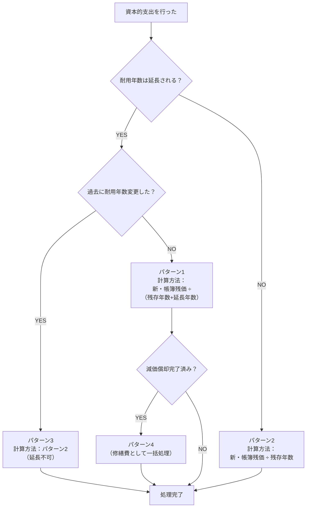

# 【ベトナム税務】資本的支出後の耐用年数はどう変わる？ – 通達45号で解く4パターン

こんにちは！マナラボの菅野です。

突然ですが、ベトナムでビジネスをしていると、こんな場面、ありませんか？

「長年使ってきた工場の機械、性能を上げるために新しい部品を取り付けたい！」
「事務所が手狭になったから、思い切って増築しよう！」

こうした**資産をパワーアップさせるための支出**、経理上どう扱えばいいのか、特に「耐用年数」がどうなるのかって、すごく分かりにくいですよね。「支出した分だけ、別の資産として新しい耐用年数を設定できるの？」「それとも、元の資産と合算しなきゃダメ？」なんて疑問が頭をよぎるかもしれません。

今日は、そんな悩ましい「資本的支出後の耐用年数」について、ベトナムの法律の原文もちょっとだけ覗き見しながら、誰にでも分かるように、やさしく解説していきますね。

この記事を読み終える頃には、**資本的支出を行った後の耐用年数の扱いがすっきり理解できて、自信を持って経理処理の判断ができるようになりますよ。**

## 大前提：支出は「独立」させず、本体と「合体」させます

まず、一番大事なことからお話ししますね。

ベトナムのルールでは、機械をパワーアップしたり、建物を増築したりした費用（これを「資本的支出」といいます）は、**独立した別の資産として扱うことはできません。**

イメージとしては、パワーアップパーツを「本体」にガチャンコと合体させる感じです。パーツだけを別で管理するんじゃなくて、**もともとあった資産の価値に、かかった費用をプラスして、一つの大きな資産として扱い直す**のが正解なんです。

これは、ベトナムの財務省が出している「通達45/2013/TT-BTC」という、固定資産のルールブックの第7条にちゃんと書いてあることなんですよ。

> **Article 7. Investment, upgrade and repair of fixed assets:**
> 1. The costs which enterprises have paid for upgrade of fixed assets are reflected by an increase in primary price of such fixed assets. These costs must not be recorded into the cost of business and productions in the period.

**【日本語訳】第7条 固定資産への投資、改良、修繕**
> 1. 企業が固定資産の改良（upgrade）のために支払った費用は、当該固定資産の取得原価の増加として反映されなければならない。これらの費用を期間中の事業生産コストに計上してはならない。

> **すごくざっくり言うと**：「固定資産を改良した費用は、元の資産の価値を増やすものとして扱いなさい。その年の経費にしちゃダメですよ」と書かれています。

この大原則を頭の片隅に置いておくと、この後の話がグッと分かりやすくなります。

---

## 4つのパターンでスッキリ！資本的支出をした後の耐用年数

では、具体的にどんな計算になるのか、4つのパターンに分けて見ていきましょう。

### 【パターン1】資産の寿命が「延びる」場合（これが基本形です）

部品交換や改良によって、資産が前より長く使えるようになるケースです。これが一番オーソドックスなパターンですね。

#### 計算の考え方
新しい年間の減価償却費は、こんな風に計算します。
- **（改良前の残りの価値 ＋ 今回の支出額）÷（残りの年数 ＋ 延長した年数）**

#### 具体的な数値例で見てみましょう
例えば、こんなケースを考えてみてください。

**前提条件**
- 工場の機械の取得原価：2,000万VND
- 耐用年数：10年
- 5年経過時点での減価償却累計額：1,000万VND

**資本的支出**
- エンジン交換などで500万VNDを支出
- 資産の寿命が3年延長されると評価

**計算**
- **新・取得原価** = 2,000万 + 500万 = 2,500万VND
- **新・帳簿残価** = 2,500万 - 1,000万 = 1,500万VND
- **新・残存耐用年数** = 5年 + 3年 = 8年
- **新・年間減価償却費** = 1,500万VND ÷ 8年 = 187.5万VND

なんだか難しそうに見えますが、大丈夫です。「パワーアップ後の価値を、新しくなった残りの年数で割る」だけですね。シンプルです。

#### ここが大事！実務のポイント
この「耐用年数を延長する」という手続き、実は**1つの資産について1回しか使えない**という厳しいルールがあります。

> **Article 10, Clause 3, c):** Enterprises may change the time of depreciation of fixed assets **once for an asset.** The extension of time of depreciation of fixed assets shall not exceed the technical life service of fixed assets and does not change the enterprises' business results from the profit to loss or vice versa in the year making a decision on the change.

**【日本語訳】第10条 第3項 c号**
> 企業は、**一つの資産につき一度のみ**、固定資産の減価償却期間を変更することができる。減価償却期間の延長は、当該固定資産の技術的寿命を超えてはならず、また変更を決定した年度の企業の業績を利益から損失へ（またはその逆へ）と変動させるものであってはならない。

しかも、事前に役所に「延長しますよ」と届け出て、承認をもらう必要があります。ちょっと手間がかかるんですね。

だから実務では、「本当に今、延長の手続きをするのがベストかな？」と慎重に考える会社さんが多いんです。

---

### 【パターン2】寿命は延びないけど「性能がアップ」した場合

次に、使える年数は変わらないけど、性能だけが良くなった、というケースです。

#### 計算の考え方
この場合は、年数はいじりません。
- **（改良前の残りの価値 ＋ 今回の支出額）÷ もともとの残りの年数**

#### 具体的な数値例で見てみましょう
パターン1と同じ前提条件で考えてみましょう。

**前提条件**
- 工場の機械の取得原価：2,000万VND
- 耐用年数：10年
- 5年経過時点での減価償却累計額：1,000万VND

**資本的支出**
- 制御システムの改良で500万VNDを支出
- 性能は向上したが、耐用年数の延長はなし

**計算**
- **新・取得原価** = 2,000万 + 500万 = 2,500万VND
- **新・帳簿残価** = 2,500万 - 1,000万 = 1,500万VND
- **残存耐用年数** = 5年（変更なし）
- **新・年間減価償却費** = 1,500万VND ÷ 5年 = 300万VND

価値は上がったけど、使える年数は変わらないので、残りの期間でパワフルに減価償却していくイメージですね。

#### 実務上の判断と、ちょっとしたリスクの話
パターン1でお話ししたように、耐用年数の延長手続きは少し面倒です。なので、あえて延長せずに、こちらのパターン2を選ぶ会社さんも少なくありません。「早く減価償却して、節税につなげたい」という経営判断ですね。

**でも、これには少しだけ注意が必要です。**

税務署から見て、「いやいや、この改良は、どう考えても寿命が延びてるでしょ！」と思われてしまうと、「ちゃんと延長の手続きをしてください」と指摘される可能性があります。

例えば、もう動かなくなった機械のエンジンを丸ごと新品に交換したのに、「寿命は延びてません」というのは、ちょっと無理があるかもしれません。資産の実際の状況に合わせて判断することが大切ですね。

---

### 【パターン3】一度寿命を延ばした資産に、「もう一回」支出した場合

「一度きりのルール」がここで効いてきます。

一度、パターン1を使って耐用年数を延長した資産に、また数年後、さらに寿命が延びるような改良を加えたとします。この時、**もう一度、耐用年数を延長することはできません。**

じゃあどうするかというと、パターン2の計算方法を使うことになります。つまり、価値だけを上乗せして、残りの年数で償却していくんですね。

---

### 【パターン4】減価償却が「終わった」資産に支出した場合

これはちょっと特殊なケースです。

帳簿上の価値がゼロになった（＝減価償却が完了した）資産を、さらに改良した場合です。この場合、**もう一度減価償却を始めることはできません。**

> **Article 9, Principles of depreciation of fixed assets:**
> 1. All of the enterprise's current fixed assets must be depreciated **excluding the following fixed assets:**
> - **Fixed assets have been fully depreciated** but are still used in production and business activities.

**【日本語訳】第9条 固定資産の減価償却の原則**
> 1. 企業が保有する全ての固定資産は減価償却されなければならないが、以下の固定資産は除く：
> - 完全に減価償却が完了しているが、引き続き生産・事業活動に使用されている固定資産。

では、この支出はどうなるのか？実は、**2つのパターン**があります。

#### パターン4A：修繕費として処理する場合
**前提条件**
- 10年前に購入した機械（取得原価：1,000万VND）
- 耐用年数10年で減価償却完了（帳簿価額：0VND）
- まだ使用中だが、老朽化により性能低下

**資本的支出**
- 主要部品交換で200万VNDを支出

**処理方法**
- この200万VNDは修繕費として、発生年度に一括で損金算入（実務上の慣行）
- 新たな減価償却は開始しない（第9条により減価償却対象外）

#### パターン4B：独立した資産として新規取得する場合
実は、**改良部分に独立性がある場合**は、新しい固定資産として扱うことができます。

**法的根拠**
> **Article 4, Clause 4, c):** Dismantling one or a number of parts of fixed assets but these parts are managed by standard of a tangible fixed asset.

**【日本語訳】第4条第4項c**
> 固定資産の一部または複数の部分を解体するが、これらの部分が有形固定資産の基準によって管理される場合

**具体例**
- 10年前の機械から古い制御システムを外し、新しい制御システム（500万VND）を設置
- 新システムは独立して動作し、単体で経済的便益を生む
- 新システムが有形固定資産の基準（3,000万VND以上、1年以上の使用期間等）を満たす

**処理方法**
- 新システムを独立した固定資産として計上
- 独自の耐用年数で減価償却を開始
- 元の機械は引き続き減価償却対象外として管理

## 実務のウラ付け：税務署の最新の回答を詳しく分析してみよう

「本当にそんなルールなの？」と思いますよね。実は、つい最近、その答え合わせができるような出来事がありました。

2024年6月5日付で、ベトナムのハンイエン省税務局が、ある日系企業（Hamaden Vietnam Co., Ltd.）からの質問に答えた公式文書（No. 2285/CTHYE-TTHT）を出したんです。これは、まさに「固定資産を改良した時のルールを教えてください」という内容でした。

この公式回答は、**この記事で解説してきた内容を、そっくりそのまま裏付けていた**だけでなく、税務当局が実際にどの条文を重視しているかも明確に示してくれています。

### 公式文書2285/CTHYE-TTHTの要点

この公式回答では、**資本的支出後の耐用年数の再決定**について、以下の重要なポイントが確認されています。

> **ハンイエン省税務局の公文2285/CTHYE-TTHT（2024年6月5日付）**では、固定資産の改良（資本的支出）を行った場合の処理について照会に回答しており、**「当該費用は固定資産の原価を増加させる。減価償却期間の見直しは通達45号第10条の規定に従って行う」**こと、さらに**「耐用年数変更は一度のみで技術的寿命を超えず、変更年度の利益が損失に転落（またはその逆）しない範囲で行う必要がある」**ことを確認しています。

**つまり、資本的支出を行った場合は、必ず耐用年数を再決定する必要がある**ということが、税務当局によって明確に示されています。

### この公式回答から読み取れる実務上の重要なポイント

1. **通達45号の現行性**: 発行から10年以上経過した現在でも、税務当局は通達45号を絶対的な基準として扱っている
2. **手続き遵守の重要性**: ルールを守らない減価償却費は、法人税法上損金として認められない
3. **「一度きり」ルールの厳格性**: 税務当局が特に重視している点として、回答の結論部分で再度強調している

この回答は、ベトナムに進出している企業にとって、すごく貴重な道しるべになりますね。特に、**日系企業からの質問に対する公式回答**という点で、実務上の参考価値が非常に高いと言えるでしょう。

## 4つのパターンの判断フロー

最後に、実際の判断に迷った時のために、フローチャートを作ってみました。

**フローのポイント**
1. **まず寿命延長の有無を判断** → これが一番重要！
2. **過去の変更履歴を確認** → 一度きりのルールをチェック
3. **減価償却状況を確認** → 完了済みなら修繕費扱い

このフローに沿って判断すれば、迷うことなく適切な処理ができるはずです。

## では、まとめますね

なんだか複雑に見えるベトナムの資本的支出後の耐用年数のルールですが、ポイントはたったの2つです。

1.  **パワーアップ費用は、本体と「合体」させること**
2.  **資本的支出後は、必ず耐用年数を再決定すること**

この2つの原則さえ押さえておけば、大抵のケースは判断に迷わなくなるはずです。特に、**「耐用年数の再決定は必須」**という点は、税務当局の公式回答でも明確に示されている重要なポイントです。

経理のルールは、一見すると難しくて、とっつきにくいかもしれません。でも、一つ一つの意味を紐解いていけば、ちゃんと納得できる理由があるものなんです。この記事が、あなたのそんな「なるほど！」の瞬間に繋がれば、とても嬉しいです。
