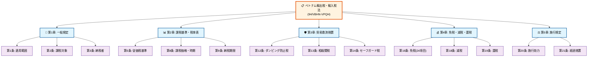
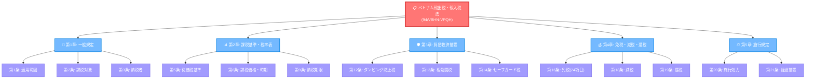
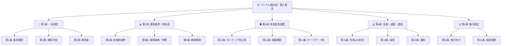
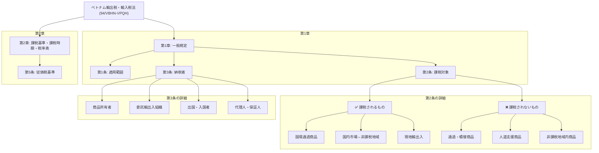

# ベトナム輸出税・輸入税法 Mermaid図表

## 1. 法律全体構造図



## 2. より詳細な階層構造図

```mermaid
graph TD
    A["📋 ベトナム輸出税・輸入税法<br/>(94/VBHN-VPQH)<br/>2025年改正版"] --> B["📖 第1章: 一般規定"]
    A --> C["📊 第2章: 課税基準・税率表"]
    A --> D["🛡️ 第3章: 貿易救済措置"]
    A --> E["💰 第4章: 免税・減税・還税"]
    A --> F["⚖️ 第5章: 施行規定"]
    
    %% 第1章の詳細
    B --> B1["第1条: 適用範囲<br/>• 課税対象の定義<br/>• 納税者の範囲<br/>• 課税基準・時期"]
    B --> B2["第2条: 課税対象<br/>• 国境通過商品<br/>• 非課税地域間移動<br/>• 現地輸出入"]
    B --> B3["第3条: 納税者<br/>• 商品所有者<br/>• 委託組織<br/>• 代理人・保証人"]
    
    %% 第2章の詳細
    C --> C1["第5条: 従価税基準<br/>• 輸出税: 商品別税率<br/>• 輸入税: 3段階税率"]
    C --> C2["第8条: 課税価格・時期<br/>• 関税価格<br/>• 申告書登録時点"]
    C --> C3["第9条: 納税期限<br/>• 通関前納税<br/>• 保証制度(30日)<br/>• 優先制度(翌月10日)"]
    
    %% 第3章の詳細
    D --> D1["第12条: ダンピング防止税<br/>• ダンピング確認<br/>• 国内産業損害<br/>• 最大5年適用"]
    D --> D2["第13条: 相殺関税<br/>• 補助金確認<br/>• 国内産業損害<br/>• 最大5年適用"]
    D --> D3["第14条: セーフガード税<br/>• 輸入急増確認<br/>• 深刻な損害<br/>• 最大4年適用"]
    
    %% 第4章の詳細
    E --> E1["第16条: 免税(24項目)<br/>• 外交特権・免除<br/>• 加工貿易<br/>• 投資優遇<br/>• 科学技術・環境保護"]
    E --> E2["第18条: 減税<br/>• 損傷・紛失商品<br/>• 損害率に応じた減税"]
    E --> E3["第19条: 還税<br/>• 過納税<br/>• 再輸入・再輸出<br/>• 輸出生産用原料"]
    
    %% 第5章の詳細
    F --> F1["第20条: 施行効力<br/>• 2016年9月1日施行<br/>• 旧法廃止"]
    F --> F2["第21条: 経過措置<br/>• 既存投資プロジェクト継続<br/>• 新法適用"]
    
    %% スタイリング
    classDef mainTitle fill:#ff6b6b,stroke:#c92a2a,stroke-width:4px,color:#fff,font-size:16px
    classDef chapter fill:#4ecdc4,stroke:#26a69a,stroke-width:3px,color:#fff,font-size:14px
    classDef article fill:#45b7d1,stroke:#2980b9,stroke-width:2px,color:#fff,font-size:12px
    classDef detail fill:#96ceb4,stroke:#6c5ce7,stroke-width:1px,color:#2d3436,font-size:10px
    
    class A mainTitle
    class B,C,D,E,F chapter
    class B1,B2,B3,C1,C2,C3,D1,D2,D3,E1,E2,E3,F1,F2 article
```



## 3. フローチャート形式



## 4. シンプル版（Notion風）



## 5. WordPress用HTML埋め込み版

```html
<div class="mermaid">
graph TD
    A["📋 ベトナム輸出税・輸入税法<br/>(94/VBHN-VPQH)"] --> B["📖 第1章: 一般規定"]
    A --> C["📊 第2章: 課税基準・税率表"]
    A --> D["🛡️ 第3章: 貿易救済措置"]
    A --> E["💰 第4章: 免税・減税・還税"]
    A --> F["⚖️ 第5章: 施行規定"]
    
    B --> B1["第1条: 適用範囲"]
    B --> B2["第2条: 課税対象"]
    B --> B3["第3条: 納税者"]
    
    C --> C1["第5条: 従価税基準"]
    C --> C2["第8条: 課税価格・時期"]
    C --> C3["第9条: 納税期限"]
    
    D --> D1["第12条: ダンピング防止税"]
    D --> D2["第13条: 相殺関税"]
    D --> D3["第14条: セーフガード税"]
    
    E --> E1["第16条: 免税(24項目)"]
    E --> E2["第18条: 減税"]
    E --> E3["第19条: 還税"]
    
    F --> F1["第20条: 施行効力"]
    F --> F2["第21条: 経過措置"]
</div>
```

## 6. Notion風 詳細構造図


