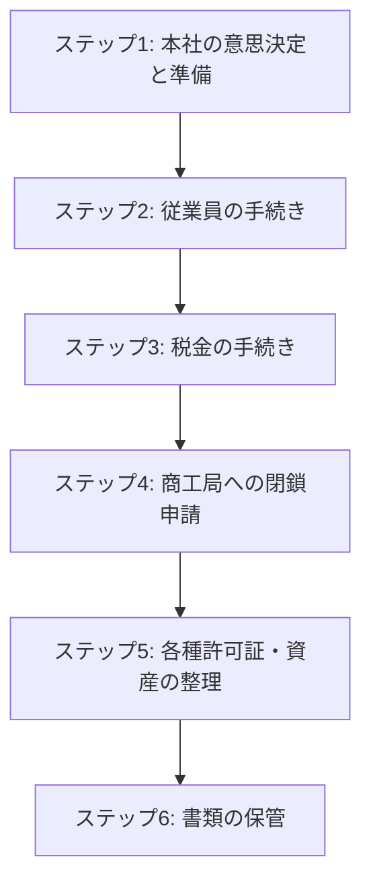

こんにちは！マナラボの菅野です。

「ベトナムの駐在員事務所を閉じることになったけど、手続きが複雑そうでどこから手をつけていいか分からない…」

会社の大きな決断とは言え、いざ自分が担当になると、何から調べればいいのか、誰に聞けばいいのか、不安になりますよね。税金、従業員、法律…と考えることがたくさんあって、頭がこんがらがってしまうのも無理はありません。

でも、安心してください。

この記事を読んでいただければ、**複雑に見える駐'在員事務所の閉鎖手続きが、どんなステップで進んでいくのか、その全体像がスッキリと理解できます。** 専門用語もできるだけかみ砕いて説明するので、法律や会計の専門家でなくても大丈夫です。

一つ一つのステップを順番に見ていけば、「何を」「いつ」「どこで」やればいいのかが明確になりますよ。

それでは、一緒に見ていきましょう！

## まずは全体像を掴みましょう！駐在員事務所閉鎖の6ステップ

駐在員事務所の閉鎖は、大きく分けると6つのステップで進んでいきます。いきなり詳細を見ると大変なので、まずはこの流れを頭に入れておくだけで、気持ちがグッと楽になりますよ。

1.  **ステップ1：本社の意思決定と準備** - すべてはここから！
2.  **ステップ2：従業員に関する手続き（労務）** - 「ありがとう」を伝える大切なステップ
3.  **ステップ3：税金に関する手続き（税務）** - きちんと納税してスッキリ！
4.  **ステップ4：商工局への公式な閉鎖申請** - いよいよ法的なゴールへ
5.  **ステップ5：各種許可証・資産の整理** - 細かい部分の後片付け
6.  **ステップ6：書類の保管と未来への備え** - 最後の、でも重要な仕事

なんだか、やることがたくさんありそうに見えますか？大丈夫です。一つ一つは、ちゃんと手順が決まっています。例えるなら、引越しの手続きに少し似ているかもしれません。役所に届け出を出して、電気やガスを止めて、荷造りをして…という流れがありますよね。それの会社版だと思って見てください。

では、それぞれのステップをもう少し詳しく見ていきましょう。

## ステップ1：本社の意思決定と準備 - すべてはここから始まります

何よりもまず、日本の本社が「ベトナムの駐在員事務所を閉じます！」と正式に決めることがスタートです。

### 閉鎖の「理由」を確認しておきましょう

法律上、駐在員事務所を閉鎖できる理由はいくつか決まっています。これを**閉鎖事由（へいさじゆう）**と言います。ざっくり言うと、こんな感じです。（根拠：政令07/2016/NĐ-CP第35条）

*   **自分たちの意思で閉じる**（これが一番多いパターンですね）
*   **本社の会社がなくなった**
*   **許可証の期限が切れた**（そして更新しなかった）
*   **ルール違反で「閉じなさい」と命令された**
*   **その他、法律で決められた条件を満たせなくなった**

ほとんどの場合が「自分たちの意思で閉じる」だと思いますが、この理由をはっきりさせておくことが大切です。

### 閉鎖の公式な決定

本社で「閉鎖します」と決めたら、その証拠となる書類（**閉鎖決定書**など）を作ります。この書類は、後の手続きで「本社がちゃんと決めたことですよ」という証明書として必要になります。

この段階で、いつ閉鎖するのか（閉鎖日）、誰が手続きを担当するのか、といった具体的な計画も立てておくと、後がスムーズに進みますよ。

### 準備すべき書類・資料一覧

ステップ1で準備しておくべき書類や資料を、カテゴリ別にまとめました。この表をチェックリストとして使っていただければ、漏れなく準備を進められますよ。

| カテゴリ | 書類・資料名 | 説明 | 備考 | 根拠条文 |
|---------|-------------|------|------|----------|
| **本社の意思決定** | 閉鎖決定書 | 本社の最高意思決定機関が発行する正式な閉鎖決定文書 | 日本語で作成、ベトナム語翻訳が必要な場合あり | 政令07/2016/NĐ-CP第36条 |
| | 閉鎖理由書 | 閉鎖の理由を明確に記載した文書 | 事業戦略変更、コスト削減など具体的で合理的な理由を記録 | 政令07/2016/NĐ-CP第35条 |
| **基本情報** | 駐在員事務所設立許可証（原本） | 商工局から発行された許可証の原本 | 閉鎖申請時に商工局に返却が必要 | 政令07/2016/NĐ-CP第36条 |
| | 駐在員事務所登録事項証明書 | 住所、代表者名、事業内容などの登録情報 | 変更履歴も含めて整理 | 政令07/2016/NĐ-CP第36条 |
| **財務・会計** | 給与台帳・経費記録 | 従業員給与の支払記録と経費の記録 | 駐在員事務所は独立会計を行わないためB/S・P/Lは不要 | 税務管理法2019年第44条 |
| | 個人所得税申告書の履歴 | 従業員給与に係る個人所得税の申告書コピー | 駐在員事務所は法人税・VAT申告義務なし | 税務管理法2019年第44条 |
| | 銀行口座残高証明書 | 事務所名義銀行口座の最終残高証明 | 日本送金時の根拠書類としても使用 | 国家銀行規定 |
| **人事・労務** | 従業員リスト | 氏名、雇用開始日、給与、役職等の情報 | 解雇手続き・補償金計算に必要 | 労働法2019年第44条 |
| | 労働契約書 | 各従業員との労働契約書コピー | 契約内容確認・補償金計算に必要 | 労働法2019年第34条 |
| | 社会保険加入履歴 | 社会保険加入状況・保険料支払い履歴 | 最終月保険料支払い・証明書発行に必要 | 社会保険法2014年 |
| **その他** | オフィス賃貸契約書 | オフィス賃貸契約書 | 解約条件（通知期間、違約金等）を確認 | 民法2015年 |
| | 印鑑登録証明書 | 警察に登録された印鑑の証明書 | 印鑑返納手続きに必要 | 公安管理規定 |
| | その他の契約書 | 清掃、警備、通信等の契約書 | 閉鎖に合わせて適切に終了させる必要 | 民法2015年 |

## ステップ2：従業員に関する手続き（労務） - 「ありがとう」を伝える大切なステップ

事務所で働いてくれている現地スタッフがいる場合、その方々との労働契約をきちんと終了させる手続きが必要です。これは、法律的な義務であると同時に、今まで一緒に頑張ってくれた仲間への大切な配慮でもあります。

### 解雇の通知は「早めに」「書面で」

事務所を閉じることで雇用契約が終わる場合、従業員の方には**少なくとも30日前まで**に書面で通知するのが望ましいです。（根拠：労働法2019年第44条）

「事務所を閉じることになったので、残念ながら雇用契約を終了します」という理由を明確に伝えます。これは法律（労働法第34条第11号）で認められた正当な理由なので、安心してください。

### 補償金の支払いを忘れずに

会社都合で退職してもらうことになるので、法律に基づいた補償金を支払う必要があります。ここで一つ、とても大切なポイントがあります。

補償金には2種類あるんです。
1.  **退職手当**：自己都合などで辞めるときにもらう、一般的な退職金のようなもの。（根拠：労働法第46条）
2.  **失業補償金**：会社側の理由（今回のように事務所がなくなるなど）で職を失う場合のもの。（根拠：労働法第47条）

駐在員事務所の閉鎖は、後者の**「失業補償金」**の対象となります。これは、一般的な退職手当よりも手厚い補償になっています。

例えば、勤続年数によっては、退職手当だと「給料の5ヶ月分」だったものが、失業補償金だと「給料の10ヶ月分」になったりします。この違いは大きいですよね。

ここを間違えてしまうと、後で「支払いが足りない」というトラブルになることがあるので、注意してくださいね。

### 社会保険の手続きも

最終月までの社会保険料をきちんと納付し、従業員が次の職場で困らないように、社会保険の手続きを完了させてあげましょう。（根拠：労働法第48条では、解雇日から14営業日以内にすべての支払いを完了することが定められています）

## ステップ3：税金に関する手続き（税務） - きちんと納税してスッキリ！

次に、税金関係の手続きです。これは、他の手続きを進める上での大前提となる、とても重要なステップです。

### 「税コード」を抹消します

駐在員事務所は、**税コード**という納税者番号を持っています。事務所を閉じるにあたり、この番号を税務署に返却するイメージです。これを**税コードの抹しょ**と言います。

税務署に「事務所を閉じるので、税コードを抹消してください」という申請（様式 24/ĐK-TCT）をします。このとき、本社が発行した「閉鎖決定書」などが必要になります。

### 税務署のチェックが入ります

申請を出すと、税務署は「この事務所は、ちゃんと税金を納めていましたか？」というチェックをします。

*   **未払いの税金はないか？**
*   **毎年の申告はきちんと行われていたか？**

もし未払いの税金があれば、この段階で全て支払う必要があります。すべてクリアになると、税務署から「はい、税金関係はすべて完了しましたよ」という証明書（**税コード無効化通知**）が発行されます。

この証明書が、次のステップに進むための「通行手形」のようなものになります。

## ステップ4：商工局への公式な閉鎖申請 - いよいよ法的なゴールへ

税金や労務の手続きが一段落したら、いよいよ駐在員事務所の設立を許可してくれた役所（**商工局**など）に、正式な閉鎖申請を行います。これが、法的に事務所を閉鎖するための最終手続きです。

### 必要な書類を揃えて提出

ここでも、いくつかの書類が必要になります。（根拠：政令07/2016/NĐ-CP第36条）
*   **活動終了通知書**：決まった様式があります。
*   **債権者リスト**：「誰かにお金を借りていませんか？」というリストです。なければ「なし」と書きます。
*   **従業員リスト**：「従業員の権利はすべて守られていますか？」というリストです。
*   **駐在員事務所設立許可証（原本）**：最初に受け取った許可証そのものを返却します。

これらの書類を提出すると、商工局は内容を審査します。

### ウェブサイトで公告されたら完了です

書類に問題がなければ、商工局は受理から5営業日以内に**自局のウェブサイト上で「この駐在員事務所は閉鎖されました」というお知らせを掲載します。**（根拠：政令07/2016/NĐ-CP第37条）

ここで面白いのは、**「閉鎖完了証明書」のような紙の書類は発行されない**ということです。ウェブサイトでの公告が、閉鎖完了の公式な証明となります。

なので、この公告ページを印刷したり、スクリーンショットを撮ったりして、大切に保管しておきましょう。これが「無事に閉鎖手続きが終わりましたよ」という証拠になります。

## ステップ5：各種許可証・資産の整理 - 細かい部分の後片付け

大きな手続きと並行して、事務所名義で使っていた細かいものの整理も進めていきましょう。

### 外国人駐在員の許可証返納

日本人駐在員の方（所長など）がいる場合、その方々の滞在資格に関する手続きも必要です。ベトナムで働くための**労働許可証（ワークパーミット）**と、滞在するための**在留カード（一時滞在許可証）**は、事務所閉鎖に伴い失効します。

これらの許可証は**失効してから15日以内**に、それぞれを発行した役所に返納する義務があります。（根拠：政令152/2020/NĐ-CPなど）

### 印鑑、銀行口座、資産の整理

*   **印鑑（社判）の返納**：もし警察に登録している印鑑があれば、返納が必要です。
*   **銀行口座の解約**：残高をゼロにして、必ず解約手続きをします。
*   **オフィスの賃貸契約の解約**：契約内容を確認して、早めに大家さんに通知しましょう。
*   **備品の処分**：机やパソコンなどをどうするか決めます。ここで、よく「これって売ってもいいの？」というご質問をいただきます。

    実は、ここには少し注意が必要です。

    というのも、駐在員事務所は「営業活動をしてはいけない」というルールがあるからです。なので、**原則として、事務所の備品を売ってお金儲けをするのはNG**なんです。（根拠：駐在員事務所は商業活動（売買行為）が禁止されています）

    「じゃあ、全部捨てるしかないの？」と思ってしまいますよね。

    でも、安心してください。閉鎖に伴う一度きりの処分であれば「事業ではない」と見なされて、事実上、売却が認められることも多いです。

    ただし、駐在員事務所として正式な契約書や領収書（インボイス）は発行できません。あくまで「非公式な譲渡」という形になります。もし高価なものを売却する場合は、どうやってお金を管理するかなど、念のため専門家に相談するのがおすすめですよ。

これらは忘れがちですが、後々のトラブルを防ぐために、一つ一つ丁寧に対応することが大切です。

## ステップ6：書類の保管と未来への備え - 最後の、でも重要な仕事

お疲れ様でした！これで法的な手続きはほぼ完了です。最後に、未来への備えとして、書類の保管を行いましょう。

### 書類は「10年間」保管します

閉鎖に関する書類は、会計法などで**最低5年〜10年間**の保管が義務付けられています。

なぜなら、閉鎖した後でも、税務署が「あの時の申告について、少し確認したいのですが…」と調査に来ることがあるからです。その時に、「書類はもうありません」では通用しないのです。（根拠：政令07/2016/NĐ-CP第38条では、閉鎖後も親会社が事務所の債務等に責任を負うと定められています）

これらの書類は、日本の本社に持ち帰って保管するか、信頼できる現地の専門家に保管を依頼するのが良いでしょう。

## よくある失敗談 - これだけは気をつけて！

最後に、駐在員事務所の閉鎖でよくある失敗談を3つだけご紹介します。他社の失敗から学んで、同じ轍を踏まないようにしましょう。

### 失敗談①：従業員への補償金を間違えて、後でトラブルに…
先ほどお話しした「退職手当」と「失業補償金」の違いを理解しておらず、少ない方の金額を支払ってしまったケースです。後から従業員に訴えられて、結局、追加で支払いと謝罪をすることになりました。

### 失敗談②：銀行口座に「謎の入金」があり、資金を送金できなかった…
駐在員事務所の銀行口座は、原則として日本の本社からの運営資金しか入金できません。しかし、B社は現地の取引先からの支払いを、便宜上この口座で受け取ってしまっていました。閉鎖時に残高を日本に送金しようとしたら、銀行に「これは違法な収益では？」と指摘され、資金が凍結されてしまいました。

### 失敗談③：所長が先に帰国してしまい、手続きがストップ…
閉鎖手続きの書類には、所長のサインが必要なものがたくさんあります。しかし、C社の所長は「あとは任せた！」と先に日本へ帰国。残されたスタッフではサインができず、多くの手続きが止まってしまいました。

## ではまとめますね

今回は、ベトナム駐在員事務所の閉鎖手続きについて、6つのステップで解説しました。

*   **ステップ1：本社の意思決定と準備**
*   **ステップ2：従業員に関する手続き（労務）**
*   **ステップ3：税金に関する手続き（税務）**
*   **ステップ4：商工局への公式な閉鎖申請**
*   **ステップ5：各種許可証・資産の整理**
*   **ステップ6：書類の保管と未来への備え**

一見すると複雑で難しそうに感じますが、一つ一つのステップを順番に、そして丁寧に進めていけば、必ずゴールにたどり着けます。

一番大切なのは、**慌てずに、計画的に進めること**です。そして、もし「これはどうしたらいいんだろう？」と迷ったら、一人で抱え込まずに、私たちのような専門家に気軽に相談してくださいね。

この記事が、あなたの不安を少しでも和らげるお役に立てれば嬉しいです。

---

*本記事は2025年時点の情報に基づいて作成されています。法令は変わることがありますので、実際の手続きの際には最新の情報をご確認くださいね。*

---

## 関連法令一覧

この記事で参照した主なベトナムの法律です。

*   **商法 (2005年)**：外国企業の駐在員事務所に関する基本規定が含まれています。
*   **政令07/2016/NĐ-CP**：駐在員事務所の設立、運営、閉鎖に関する最も重要なルールを定めています。
*   **通達11/2016/TT-BCT**：閉鎖申請書など、具体的な書類の様式（フォーマット）を定めています。
*   **労働法 (2019年)**：従業員の解雇や補償金について定めています。
*   **政令145/2020/NĐ-CP**：労働法の詳細なルール（退職手当の計算方法など）を定めています。
*   **社会保険法 (2014年)**：従業員の社会保険手続きについて定めています。
*   **税務管理法 (2019年改正)**：税コードの抹消や税務調査に関する手続きを定めています。
*   **政令152/2020/NĐ-CP**：外国人駐在員の労働許可証（ワークパーミット）に関するルールを定めています。
*   **出入国管理法**：外国人駐在員の在留カード（一時滞在許可証）に関するルールを定めています。
