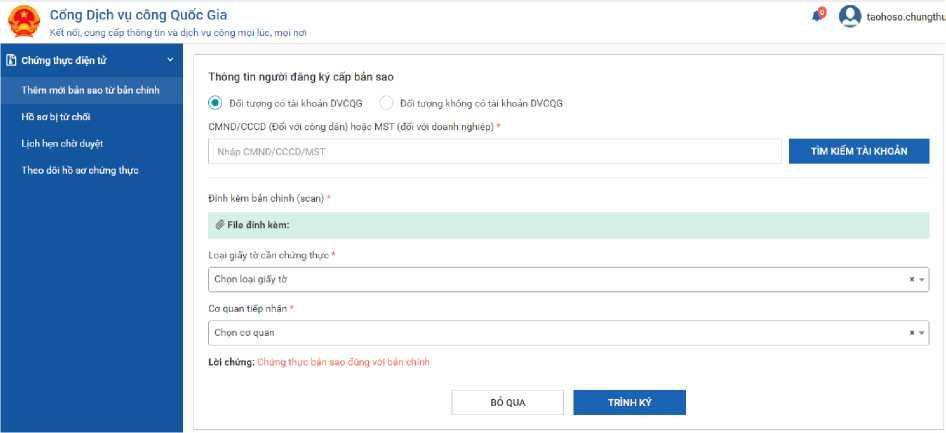
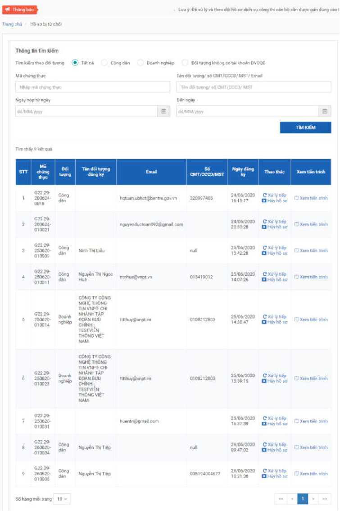
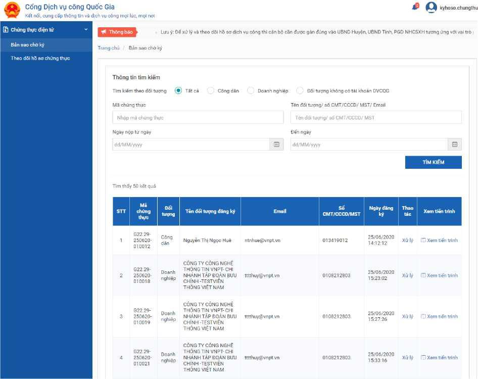
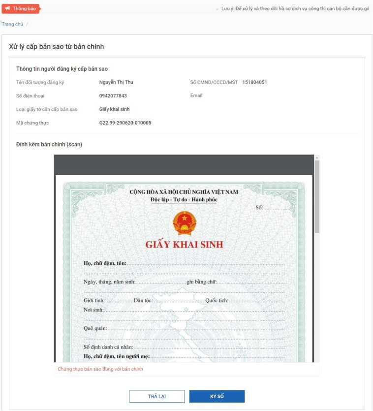
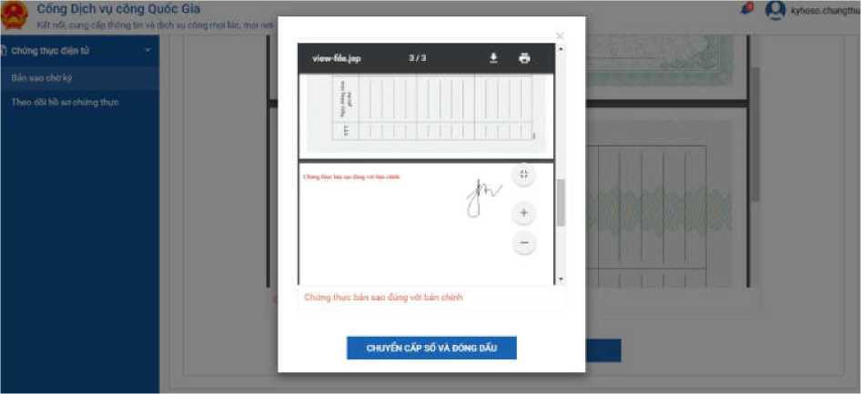
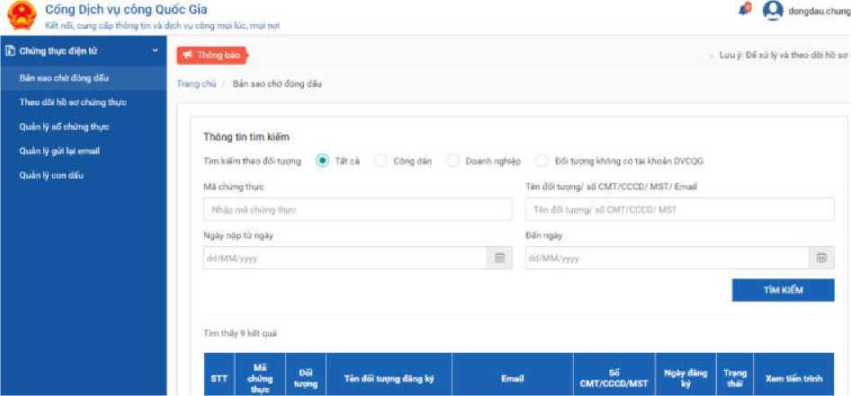
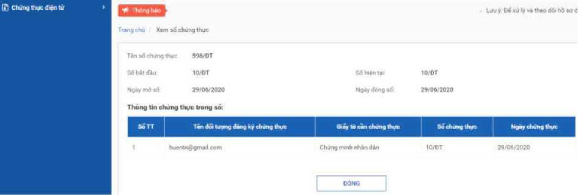
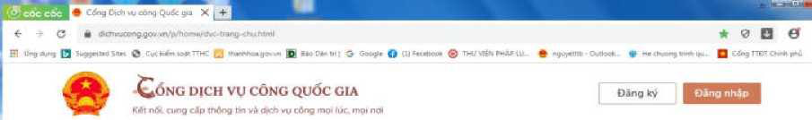
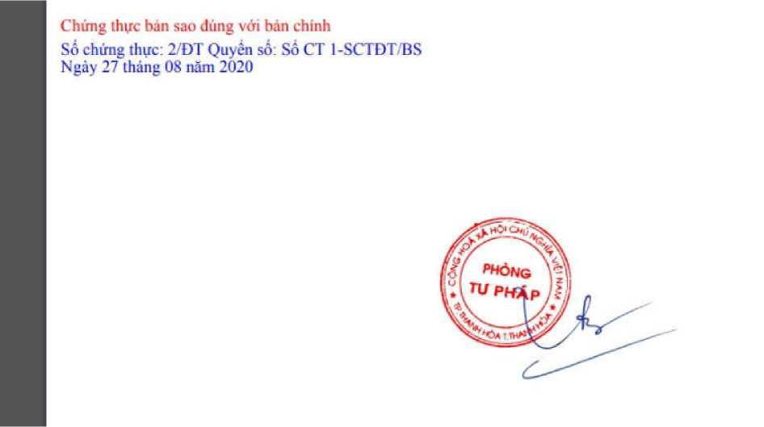

# 電子証明書申請マニュアル
## ベトナム行政手続きガイド

### 概要
このマニュアルは、ベトナムの電子証明書申請手続きについて、PDFから抽出した内容を基に作成された包括的なガイドです。


### 手続きの概要
**電子証明書申請**とは、紙の原本から電子コピーを作成し、それを認証する手続きです。

### 主な手順

#### 1. 事前予約（任意）
- 国家行政サービスポータル（DVCQG）で予約
- 管轄機関を選択して予約
- 必要な情報を入力



#### 2. 書類提出
- 原本書類を持参
- 関連書類を準備
- 手数料を支払い


#### 3. 審査・処理
- 職員による原本確認
- スキャン作成
- 電子署名


#### 4. 認証完了
- 電子認証番号発行
- 電子コピー受領


### 必要な書類
- **原本書類**（認証対象）
- **身分証明書**
- **関連書類**（必要に応じて）



### 手数料
- **手続き手数料**：規定に従う
- **支払い方法**：現地での現金支払い



### 処理時間
- **標準処理時間**：3営業日以内
- **緊急処理**：追加手数料で可能

### 注意事項
- ✅ 原本の状態が良好であること
- ✅ 必要な情報が正確に記載されていること
- ✅ 手数料の準備を忘れずに
- ✅ 管轄機関の営業時間を確認

### 詳細手順（PDFから抽出）

#### ステップ0: 事前準備
```
組織・個人は以下の方法で予約可能：
- DVCQGポータルにログイン
- 「電子証明書申請」手続きを選択
- 管轄機関を選択（省・区・村レベル）
- 予約情報を入力
```



#### ステップ1: 書類受付
```
職員による確認：
- 原本書類の状態確認
- 認証要件の確認
- DVCQGシステムへの登録
- スキャン作成とファイル添付
- 電子署名の準備
```


#### ステップ2: 承認
```
リーダーによる処理：
- DVCQGシステムにログイン
- 申請書類の確認
- 電子署名の実行
```



#### ステップ3: 認証完了
```
最終処理：
- 電子認証番号の発行
- 機関印の電子署名
- 申請者への通知
- 電子コピーの配信
```



### システム画面ガイド

#### DVCQGポータル画面


#### 申請フォーム


#### 管理画面


### 技術仕様
- **ファイル形式**：PDF
- **電子署名**：デジタル証明書使用
- **認証番号**：自動生成
- **配信方法**：DVCQGアカウントまたはメール


### トラブルシューティング

#### よくある問題と解決方法


#### エラーメッセージ一覧


### 関連リンク
- [国家行政サービスポータル](https://dichvucong.gov.vn/)
- [管轄機関検索](https://ochodua.hanoi.gov.vn/)

### 参考資料


---

*このマニュアルは、PDFから抽出した内容を基に作成されました。最新の情報については、公式サイトでご確認ください。*

**作成日**: 2025年1月
**データソース**: ベトナム行政手続きPDF
**抽出画像数**: 29枚
**抽出テキスト**: 95セクション
