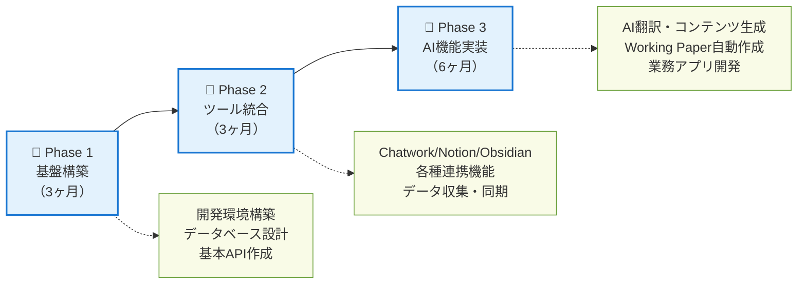

# manaboAI システム開発プロジェクト概要

**作成日**: 2025年9月9日  
**プロジェクト名**: manaboAI 統合業務支援システム

## プロジェクト背景・目的（DESC法による整理）

### 🔍 現状把握（Describe）
Manaboxでは現在、以下の業務を個別に手作業で行っている状況です：
- Chatworkの膨大なテキストデータから手動でクライアント情報を整理
- ベトナム語記事を一つずつ翻訳・編集して日本語コンテンツを作成
- 各言語のフォーム・雛形を個別に作成・管理
- Notionに蓄積された質問データの活用が限定的
- 各ツール（Chatwork、Notion、Obsidian）が分断され、情報が散在

### 💡 課題の理由（Explain）
ベトナム進出企業への高品質なサービス提供において、多言語対応と迅速な情報処理が競争優位の源泉となっています。しかし、現在の手作業中心の業務フローでは：
- 処理時間の増大によるサービス提供の遅延
- 人的リソースの非効率な配置
- 品質のばらつきとミスの発生リスク
- 蓄積された知識・データの十分な活用ができていない

### 🎯 具体的な目標（Specify）
**「多言語AIアシスタントによる業務自動化プラットフォーム」**の構築を目指します。
既存データとツールを統合し、AI技術により高品質なコンテンツ・文書を自動生成できる統合システムを開発します。

### 🌟 期待される成果（Consequences）
- **業務効率**: 80%以上の時間短縮（Working Paper作成、翻訳業務等）
- **サービス品質**: 一貫した高品質なアウトプット
- **知識活用**: 過去データの有効活用による付加価値向上
- **競争優位性**: AI活用による他社差別化の実現

## 要求事項一覧

| No. | 要求事項 | 対象言語 | 関連ツール | 優先度 |
|-----|---------|---------|-----------|--------|
| 1 | Chatworkデータからクライアント別Working Paper自動生成 | 日本語・ベトナム語 | Chatwork | 高 |
| 2 | ベトナム語記事→日本語コンテンツ大量自動変換 | ベトナム語→日本語 | - | 高 |
| 3 | 多言語フォーム・雛形の自動生成・管理 | ベトナム語・日本語・英語 | - | 中 |
| 4 | 質問データベース化と柔軟な文章化システム | 日本語・ベトナム語 | Notion | 高 |
| 5 | Obsidian知識ベース連携 | 日本語 | Obsidian | 中 |
| 6 | Notion完全連携・同期 | 日本語・ベトナム語 | Notion | 高 |
| 7 | カスタムビジネスアプリ・ツール開発 | 多言語 | 複数 | 低 |

## 共通機能要件

上記要求から導き出される**3つの核心機能**：

### 🤖 AI多言語コンテンツエンジン
- **自動翻訳・編集**: ベトナム語⇔日本語⇔英語の高品質変換
- **文章生成**: テンプレートベース＋AI生成のハイブリッド
- **品質管理**: 人間レビュー組み込み型のワークフロー

### 🔗 統合データ・ツール連携
- **Chatwork**: テキストデータ自動収集・分析
- **Notion**: 質問DB構築・同期・活用
- **Obsidian**: 知識ベース統合・検索

### 📄 自動文書・アプリ生成
- **Working Paper**: クライアント情報自動挿入
- **フォーム・雛形**: 多言語対応テンプレート管理
- **カスタムツール**: 業務特化アプリケーション

## 開発アプローチ

## 期待される効果

| 期間 | 主な成果 | 業務への影響 |
|-----|--------|----------|
| **3ヶ月** | • 基盤システム構築完了 • 基本的なツール連携開始 | 開発基盤確立 |
| **6ヶ月** | • Chatwork→Working Paper自動生成 • ベトナム語→日本語コンテンツ変換 • 全ツール連携完了 | **業務時間50%短縮** |
| **12ヶ月** | • 高度なAI質問応答システム • 多言語フォーム自動生成 • カスタムアプリ完成 | **業務時間80%短縮** **サービス品質向上** |

## 主要リスクと対策

| リスク | 対策 |
|-------|-----|
| **AI翻訳の精度問題** | 人間校正プロセス組み込み |
| **既存ツールのAPI変更** | 複数の代替手段確保 |
| **データセキュリティ** | 暗号化・アクセス制御強化 |
| **システム障害時の業務停止** | 段階的導入・手動バックアップ維持 |

## アクションプラン

### ✅ 即座に開始
- **Phase 1**: 開発環境構築・要件定義
- **プロトタイプ**: Working Paper生成機能

### 📅 3ヶ月以内
- **Chatwork API連携**: データ取得・分析機能
- **Notion API連携**: 質問データベース構築

### 🎯 6ヶ月目標  
- **AI翻訳システム**: ベトナム語→日本語変換
- **統合ダッシュボード**: 各ツール統合管理画面

---

**プロジェクト責任者**: 永井義直氏  
**開発期間**: 12ヶ月  
**予算**: 別途技術仕様書にて詳細算定  
**成功指標**: 業務時間80%短縮、クライアント満足度向上、コスト削減
