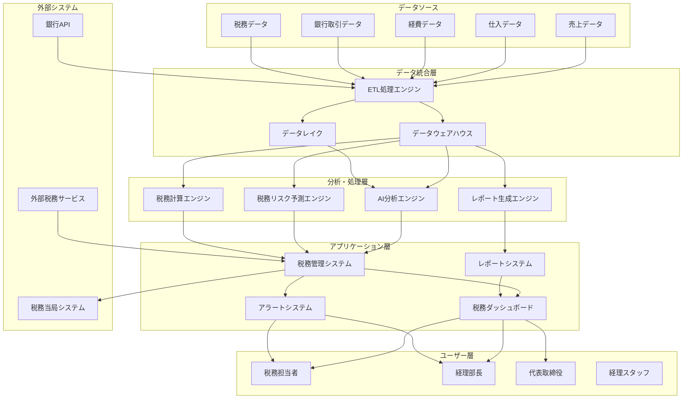
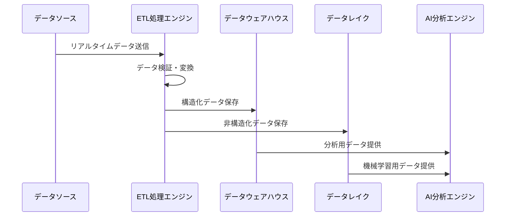
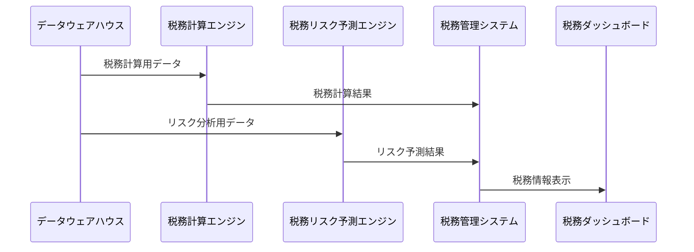

# データフロー・システム構成図

## システム全体構成図

## データフロー詳細

### 1. データ収集フロー

### 2. 税務処理フロー

## システム構成詳細

### データベース層

#### データウェアハウス
- **ツール**: PostgreSQL
- **用途**: 構造化データの保存・管理
- **データ**: 売上、仕入、経費、税務データ
- **特徴**: 高速クエリ、ACID特性

#### データレイク
- **ツール**: Apache Hadoop
- **用途**: 非構造化データの保存・管理
- **データ**: 文書、画像、ログデータ
- **特徴**: 大容量データ保存、柔軟なスキーマ

### 分析・処理層

#### AI分析エンジン
- **ツール**: Python + TensorFlow
- **用途**: 機械学習による税務データ分析
- **機能**: 異常検知、パターン認識、予測分析
- **特徴**: リアルタイム分析、高精度予測

#### 税務リスク予測エンジン
- **ツール**: Python + Scikit-learn
- **用途**: 税務リスクの予測・評価
- **機能**: リスクスコア計算、アラート生成
- **特徴**: 多変量分析、時系列分析

#### 税務計算エンジン
- **ツール**: Java + Spring Boot
- **用途**: 税務計算の自動化
- **機能**: 各種税務計算、申告書生成
- **特徴**: 高精度計算、自動検証

### アプリケーション層

#### 税務管理システム
- **ツール**: React + Node.js
- **用途**: 税務業務の統合管理
- **機能**: 税務申告、リスク管理、監査対応
- **特徴**: 直感的UI、リアルタイム更新

#### 税務ダッシュボード
- **ツール**: React + D3.js
- **用途**: 税務情報の可視化
- **機能**: グラフ表示、レポート生成、アラート表示
- **特徴**: インタラクティブ、カスタマイズ可能

#### レポートシステム
- **ツール**: Python + ReportLab
- **用途**: 税務レポートの自動生成
- **機能**: PDF生成、Excel出力、メール配信
- **特徴**: 自動化、テンプレート化

### セキュリティ・権限管理

#### 認証・認可
- **ツール**: OAuth 2.0 + JWT
- **機能**: ユーザー認証、権限管理
- **特徴**: シングルサインオン、細粒度権限制御

#### データ暗号化
- **ツール**: AES-256
- **機能**: データの暗号化・復号化
- **特徴**: 転送時・保存時の暗号化

#### 監査ログ
- **ツール**: ELK Stack
- **機能**: システム利用ログの記録・分析
- **特徴**: リアルタイム監視、異常検知

## データ統合の仕組み

### ETL処理
1. **Extract**: 各種データソースからのデータ抽出
2. **Transform**: データの変換・正規化
3. **Load**: データウェアハウス・データレイクへの格納

### データ品質管理
- **データ検証**: 入力データの妥当性チェック
- **データクリーニング**: 異常値・重複データの除去
- **データ標準化**: データ形式の統一

### リアルタイム処理
- **ストリーミング処理**: Apache Kafka
- **リアルタイム分析**: Apache Spark Streaming
- **即座のアラート**: 異常値検知時の即座通知

## パフォーマンス最適化

### データベース最適化
- **インデックス最適化**: クエリ性能向上
- **パーティショニング**: 大容量データの効率的管理
- **キャッシュ**: Redis による高速アクセス

### アプリケーション最適化
- **CDN**: 静的コンテンツの高速配信
- **ロードバランシング**: 負荷分散
- **マイクロサービス**: スケーラブルなアーキテクチャ

このシステム構成により、コクヨベトナムの税務データを効率的に管理・分析し、税務リスクの事前予測と適切な対応を実現しています。
