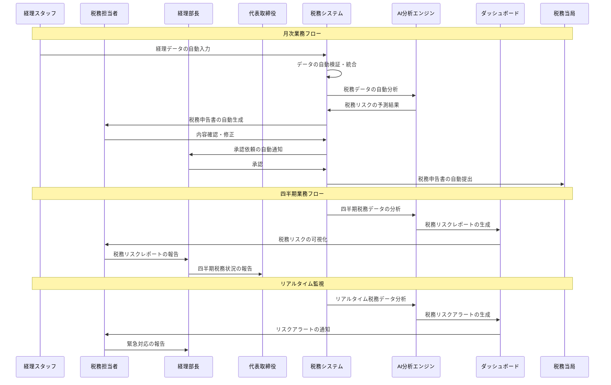

# システム導入後業務フロー

## 現在の税務レビュー業務プロセス

### 全体業務フロー

## 詳細業務プロセス

### 1. 自動化された税務処理

#### 1.1 データの自動収集・統合
- **システム**: 税務データ管理システム
- **頻度**: リアルタイム
- **内容**:
  - 売上データの自動収集
  - 仕入データの自動収集
  - 経費データの自動収集
  - 銀行取引データの自動収集
  - 複数拠点データの自動統合

#### 1.2 税務データの自動分析
- **システム**: AI分析エンジン
- **頻度**: リアルタイム・日次
- **内容**:
  - 売上税の自動計算
  - 仕入税の自動計算
  - 経費の自動税務処理
  - 税務データの自動検証
  - 異常値の自動検出

### 2. 自動化された税務申告

#### 2.1 税務申告書の自動生成
- **システム**: 税務申告書作成システム
- **頻度**: 月次・年次
- **内容**:
  - 付加価値税申告書の自動生成
  - 法人税申告書の自動生成
  - その他税務申告書の自動生成
  - 申告書の自動チェック
  - エラーの自動検出・修正提案

#### 2.2 税務申告書の自動確認・提出
- **システム**: 税務申告管理システム
- **頻度**: 月次・年次
- **内容**:
  - 申告書の自動内容確認
  - 承認フローの自動化
  - 税務当局への自動提出
  - 提出状況の自動追跡
  - 確認書の自動受領

### 3. 自動化された税務リスク管理

#### 3.1 税務リスクの自動予測
- **システム**: AI税務リスク予測システム
- **頻度**: リアルタイム・日次
- **内容**:
  - 税制改正情報の自動収集
  - 税務リスクの自動評価
  - リスクスコアの自動計算
  - リスクアラートの自動生成
  - 対応策の自動提案

#### 3.2 税務監査の自動準備
- **システム**: 税務監査準備システム
- **頻度**: 年次・税務調査時
- **内容**:
  - 監査資料の自動準備
  - 監査チェックリストの自動生成
  - 監査対応の自動支援
  - 監査結果の自動分析
  - 改善提案の自動生成

## システム導入後の改善点

### 1. 業務効率性の向上
- **自動化の実現**: 税務データの自動集計・入力
- **重複作業の削減**: 複数拠点の統合処理
- **エラーの削減**: 自動検証による人的ミス削減
- **時間の短縮**: 効率的な業務プロセス

### 2. 税務リスク管理の強化
- **リスクの可視化**: 税務リスクの事前把握
- **迅速な対応**: 税制改正への迅速対応
- **情報の統合**: 税務情報の一元管理
- **予測精度の向上**: AI活用による高精度予測

### 3. データ管理の改善
- **データの統合**: 複数拠点のデータ統合
- **データの整合性**: 自動処理によるデータ整合性確保
- **履歴管理**: 税務データの完全履歴管理
- **分析の強化**: 税務データの高度分析・可視化

### 4. コミュニケーションの改善
- **情報共有の強化**: 関係者間の情報共有
- **意思決定の迅速化**: 税務関連の迅速な意思決定
- **責任の明確化**: 税務責任の明確化
- **報告の体系化**: 税務報告の体系化

## システム導入後の業務時間

### 月次業務時間
- **経理データ処理**: 20時間（50%削減）
- **税務データ集計**: 5時間（75%削減）
- **税務申告書作成**: 10時間（67%削減）
- **確認・承認**: 5時間（50%削減）
- **合計**: 40時間/月（60%削減）

### 年次業務時間
- **年次税務申告**: 30時間（63%削減）
- **税務監査対応**: 25時間（58%削減）
- **税務リスク評価**: 15時間（63%削減）
- **合計**: 70時間/年（61%削減）

### 総業務時間
- **月次業務**: 40時間 × 12ヶ月 = 480時間/年
- **年次業務**: 70時間/年
- **合計**: 550時間/年（60%削減）

## システム導入後のコスト削減

### 人件費削減
- **税務担当者**: 830時間削減 × 時給 = 年間人件費削減
- **経理スタッフ**: 320時間削減 × 時給 = 年間人件費削減
- **経理部長**: 70時間削減 × 時給 = 年間人件費削減

### 外部費用削減
- **外部税務顧問**: 顧問費の削減
- **税務監査費用**: 監査準備時間の削減
- **税務調査対応費用**: 調査対応時間の削減

### 機会コストの削減
- **税務リスクによる損失**: 罰金・追加税額の削減
- **業務効率の向上**: 他業務への時間確保
- **意思決定の迅速化**: 経営判断の迅速化

## システム導入後の成果指標

### 定量的成果
- **税務申告精度**: 95% → 99%（4%向上）
- **税務リスク予測精度**: 70% → 85%（15%向上）
- **税務処理時間**: 1,380時間 → 550時間（60%削減）
- **税務エラー発生率**: 5% → 1%（80%削減）

### 定性的成果
- **税務コンプライアンスの強化**: 税務リスクの事前把握
- **業務効率の向上**: 自動化による業務効率化
- **意思決定の迅速化**: リアルタイム情報による迅速な判断
- **従業員満足度の向上**: 単純作業の削減による満足度向上

このシステム導入後の業務フローは、自動化とAI活用により、大幅な効率化と精度向上を実現しています。税務リスクの事前予測と適切な対応により、コクヨベトナムの税務コンプライアンスが大幅に強化されています。
