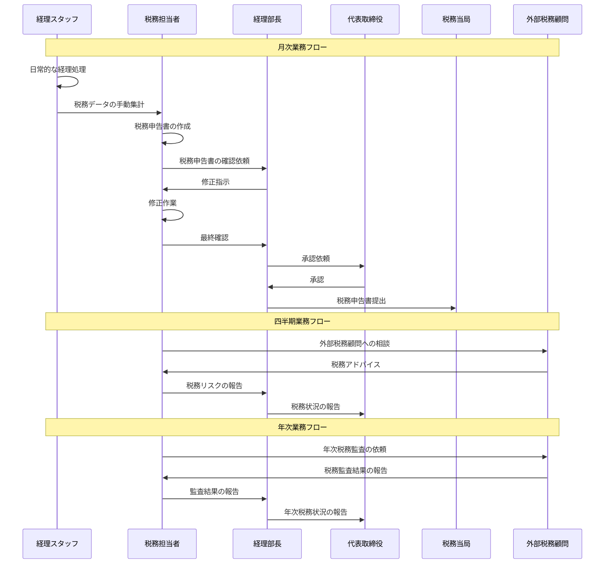

# システム導入前業務フロー

## 税務レビュー導入前の業務プロセス

### 全体業務フロー

## 詳細業務プロセス

### 1. 日常的な税務処理

#### 1.1 経理データの処理
- **担当者**: 経理スタッフ
- **頻度**: 日次
- **内容**:
  - 売上データの入力
  - 仕入データの入力
  - 経費データの入力
  - 銀行取引データの入力

#### 1.2 税務データの集計
- **担当者**: 税務担当者
- **頻度**: 月次
- **内容**:
  - 売上税の計算
  - 仕入税の計算
  - 経費の税務処理
  - 税務データの手動集計

### 2. 税務申告業務

#### 2.1 税務申告書の作成
- **担当者**: 税務担当者
- **頻度**: 月次・年次
- **内容**:
  - 付加価値税申告書の作成
  - 法人税申告書の作成
  - その他税務申告書の作成
  - 申告書の手動チェック

#### 2.2 税務申告書の確認・承認
- **担当者**: 経理部長・代表取締役
- **頻度**: 月次・年次
- **内容**:
  - 申告書の内容確認
  - 修正指示の出し
  - 最終承認
  - 税務当局への提出

### 3. 税務リスク管理

#### 3.1 税務リスクの把握
- **担当者**: 税務担当者
- **頻度**: 不定期
- **内容**:
  - 税制改正情報の収集
  - 税務リスクの手動評価
  - 外部税務顧問への相談
  - リスク対応策の検討

#### 3.2 税務監査対応
- **担当者**: 税務担当者・経理部長
- **頻度**: 年次・税務調査時
- **内容**:
  - 税務監査の準備
  - 監査資料の準備
  - 監査対応
  - 監査結果の分析

## 導入前の課題

### 1. 業務効率性の課題
- **手動処理の多さ**: 税務データの手動集計・入力
- **重複作業**: 複数拠点での同様の作業
- **エラーの発生**: 手動処理による人的ミス
- **時間の浪費**: 非効率な業務プロセス

### 2. 税務リスク管理の課題
- **リスクの見落とし**: 税務リスクの事前把握不足
- **対応の遅れ**: 税制改正への対応遅れ
- **情報の分散**: 税務情報の統合管理不足
- **予測精度の低さ**: 税務リスクの予測精度不足

### 3. データ管理の課題
- **データの分散**: 複数拠点のデータ統合不足
- **データの不整合**: 手動処理によるデータ不整合
- **履歴管理の困難**: 税務データの履歴管理不足
- **分析の困難**: 税務データの分析・可視化不足

### 4. コミュニケーションの課題
- **情報共有の不足**: 関係者間の情報共有不足
- **意思決定の遅れ**: 税務関連の意思決定遅れ
- **責任の不明確**: 税務責任の不明確
- **報告の非体系化**: 税務報告の非体系化

## 導入前の業務時間

### 月次業務時間
- **経理データ処理**: 40時間
- **税務データ集計**: 20時間
- **税務申告書作成**: 30時間
- **確認・承認**: 10時間
- **合計**: 100時間/月

### 年次業務時間
- **年次税務申告**: 80時間
- **税務監査対応**: 60時間
- **税務リスク評価**: 40時間
- **合計**: 180時間/年

### 総業務時間
- **月次業務**: 100時間 × 12ヶ月 = 1,200時間/年
- **年次業務**: 180時間/年
- **合計**: 1,380時間/年

## 導入前のコスト

### 人件費
- **税務担当者**: 1,380時間 × 時給 = 年間人件費
- **経理スタッフ**: 480時間 × 時給 = 年間人件費
- **経理部長**: 120時間 × 時給 = 年間人件費

### 外部費用
- **外部税務顧問**: 年間顧問費
- **税務監査費用**: 年次監査費用
- **税務調査対応費用**: 調査発生時

### 機会コスト
- **税務リスクによる損失**: 罰金・追加税額
- **業務効率の低下**: 他業務への影響
- **意思決定の遅れ**: 経営判断への影響

このシステム導入前の業務フローは、手動処理が多く、効率性と精度に課題がありました。これらの課題を解決するため、システム導入による業務の自動化・効率化が求められていました。
