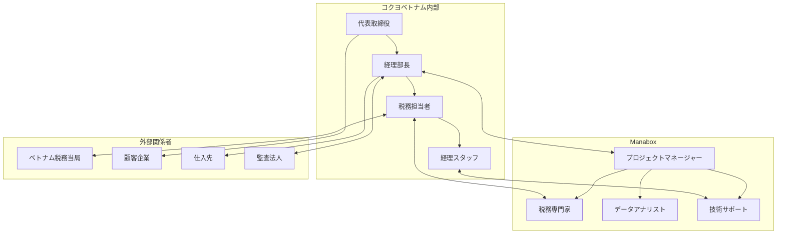

# ステークホルダーマップ

## ステークホルダー関係図

## 内部ステークホルダー詳細

### 経営層・意思決定者

#### 代表取締役
- **役割**: 最終意思決定者、戦略的方針決定
- **関心事**: 税務リスクの最小化、事業安定性の確保、コンプライアンス確保
- **影響力**: 最高
- **関心度**: 最高
- **コミュニケーション頻度**: 四半期報告、重要事項発生時

### 実務責任者

#### 経理部長
- **役割**: 税務戦略の策定・実行、経理部門の統括
- **関心事**: 税務申告の正確性、税務レビューの効率化、コスト管理
- **影響力**: 最高
- **関心度**: 最高
- **コミュニケーション頻度**: 月次報告、四半期レビュー

#### 税務担当者
- **役割**: 日常的な税務処理、税務データ管理
- **関心事**: 税務リスクの事前把握、税制改正への対応、業務効率化
- **影響力**: 高
- **関心度**: 高
- **コミュニケーション頻度**: 週次報告、日常的な連絡

### 現場スタッフ

#### 経理スタッフ
- **役割**: 日常的な経理処理、税務データ入力
- **関心事**: 日常的な税務処理の効率化、システム操作の簡易化
- **影響力**: 中
- **関心度**: 中
- **コミュニケーション頻度**: 必要時、研修時

## 外部ステークホルダー詳細

### 顧客

#### 企業顧客
- **特徴**: オフィス用品を購入する企業・団体
- **関心事**: 安定した製品供給、適正な価格設定、品質保証
- **影響**: 売上に直接影響、税務処理の複雑化要因

#### 個人顧客
- **特徴**: 文房具を購入する個人
- **関心事**: 製品品質、価格、入手しやすさ
- **影響**: 売上の一部、税務処理への影響は限定的

### 外注先・パートナー

#### Manabox
- **役割**: 税務レビュー・税務リスクマネジメント支援
- **関心事**: プロジェクト成功、継続的な関係構築、技術力の実証
- **影響**: 税務リスクマネジメントの質に直接影響

#### ベトナム税務当局
- **役割**: 税務監査、税務指導
- **関心事**: 税務コンプライアンスの確保、適正な税務申告
- **影響**: 税務調査、罰金等のリスク要因

#### 監査法人
- **役割**: 財務監査、税務監査
- **関心事**: 財務・税務の適正性、コンプライアンス確保
- **影響**: 監査意見、税務リスクの評価

#### 仕入先
- **役割**: 原材料・部品の供給
- **関心事**: 安定した取引関係、適正な価格設定
- **影響**: 税務処理の複雑化要因（移転価格等）

## ステークホルダー管理戦略

### 高影響力・高関心度（経営層・実務責任者）
- **戦略**: 積極的な関与と協力
- **コミュニケーション**: 定期的な報告、意思決定への参画
- **管理方法**: 直接的な関係構築、信頼関係の確立

### 高影響力・低関心度（税務当局）
- **戦略**: 満足度の維持
- **コミュニケーション**: 必要最小限の情報提供
- **管理方法**: コンプライアンス確保、適切な対応

### 低影響力・高関心度（経理スタッフ）
- **戦略**: 情報の提供と教育
- **コミュニケーション**: 定期的な情報共有、研修実施
- **管理方法**: スキル向上支援、モチベーション維持

### 低影響力・低関心度（個人顧客）
- **戦略**: 監視
- **コミュニケーション**: 必要時のみ
- **管理方法**: 定期的な状況確認

## コミュニケーション計画

### 定期的なコミュニケーション
- **四半期報告**: 経営層・実務責任者向け
- **月次報告**: 実務責任者向け
- **週次報告**: 税務担当者向け
- **必要時報告**: 全ステークホルダー向け

### コミュニケーション手段
- **対面会議**: 重要事項、意思決定事項
- **オンライン会議**: 定期的な報告、日常的な連絡
- **メール**: 詳細情報の共有、記録の残存
- **ダッシュボード**: リアルタイム情報の共有

### エスカレーション手順
1. **レベル1**: 税務担当者 → 経理部長
2. **レベル2**: 経理部長 → 代表取締役
3. **レベル3**: 代表取締役 → 本社（必要時）

このステークホルダーマップは、プロジェクトの成功に向けて、各関係者の役割と責任を明確にし、効果的なコミュニケーションと関係管理を実現するための基盤となります。
