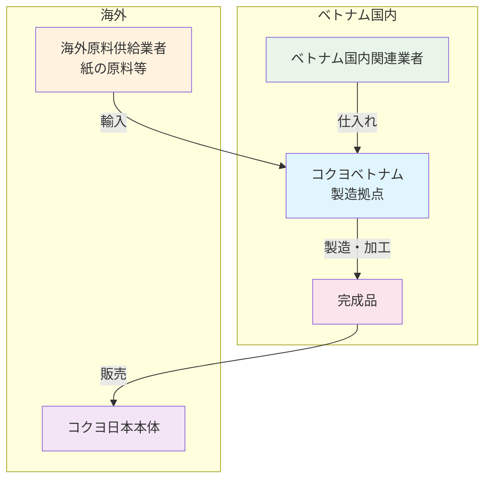

# 📋 コクヨベトナム - 包括的プロジェクト概要書

---
## 関連リンク
- [📋 クライアント一覧](../../ClientsList.md) - 全クライアント一覧
- Airtable：[リンク]
- プロジェクト進行シート：[リンク]
- 関連資料一式（Googleドライブ）：[リンク]
---

## 📈 次やること

### 現在の課題
- 四半期ごとの税務レビューの効率化
- 税務リスクの事前予測精度向上
- ベトナム税制改正への迅速な対応

### 現在の取り組み
- 四半期税務レビューの定期実施
- 税務リスク評価システムの構築
- 税務コンプライアンス強化支援
---

## 🎯 プロジェクト概要

### クライアント基本情報
- **企業名**: コクヨベトナム（KOKUYO VIETNAM）
- **事業内容**: 文房具・オフィス家具の製造・販売
- **代表者**: [代表者名]
- **所在地**: ハイフォン市（本社・工場）、ハノイ市・ホーチミン市（代表事務所）
- **ウェブサイト**: https://www.kokuyo.vn/
- **事業特徴**: ベトナムにおけるオフィス用品業界のリーディングカンパニー

### 主要事業
1. **文房具製造・販売** - ベトナム国内での文房具製品の製造・販売
2. **オフィス家具製造・販売** - オフィス家具の製造・販売事業
3. **オフィス用品販売** - 各種オフィス用品の販売・流通

### 事業の特徴・強み
- ベトナム国内での製造拠点を持つ安定した事業基盤
- オフィス用品業界での豊富な経験と実績
- ハイフォン、ハノイ、ホーチミンの3拠点での事業展開

### ビジネススキーム

コクヨベトナムは以下のビジネススキームで事業を展開しています：

**ビジネスフロー詳細：**
1. **仕入れ段階**: ベトナム国内の関連業者から原材料・部品を仕入れ
2. **原料輸入**: 必要に応じて紙の原料等を海外から輸入
3. **製造・加工**: ベトナム国内の製造拠点で製品を製造・加工
4. **販売**: 完成品を主にコクヨ日本本体に販売
5. **EPE（Export Processing Enterprise）**: 製造拠点としての役割に特化

**事業の特徴：**
- **EPE制度活用**: ベトナムの輸出加工企業制度を活用した効率的な製造・輸出体制
- **垂直統合**: 原料調達から製造、販売まで一貫したサプライチェーン
- **日本市場向け**: 主にコクヨ日本本体への供給に特化した事業モデル
---

## 📈 プロジェクト全体の流れ

### Phase 1: 基盤構築期（2024年）
**目標**: 税務レビュー体制の確立

#### 実装したソリューション
- 四半期税務レビュープロセスの確立
- 税務リスク評価フレームワークの構築
- 税務コンプライアンスチェックリストの作成

#### 成果
- 定期的な税務レビューの実施体制確立
- 税務リスクの可視化と管理システム構築
- 税務申告の精度向上

### Phase 2: データ活用期（2024年-2025年）
**目標**: 税務リスク予測精度の向上

#### 実装した改善策
- 税務データ分析システムの導入
- 税務リスク予測モデルの構築
- 税制改正情報の自動収集システム

#### 成果
- 税務リスクの事前予測精度向上
- 税制改正への迅速な対応体制確立
- 税務コンプライアンスの強化

### Phase 3: 現在（2025年）
**目標**: 継続的な税務リスクマネジメントの最適化

#### 現在の検討・実装内容
- AIを活用した税務リスク予測システムの検討
- 税務データの可視化ダッシュボードの構築
- 税務トレーニングプログラムの実施
---

## 🏢 組織・ステークホルダー構成

### 内部ステークホルダー分析

#### 経営層・意思決定者
| 担当者 | 役割 | 影響力 | 関心度 | 主要関心事 |
|---|---|---|---|---|
| **[名前]** | 代表取締役 | 最高 | 最高 | 税務リスクの最小化、コンプライアンス確保 |

#### 実務責任者
| 担当者 | 役割 | 影響力 | 関心度 | 主要関心事 |
|---|---|---|---|---|
| **[名前]** | 経理部長 | 最高 | 最高 | 税務申告の正確性、税務レビューの効率化 |
| **[名前]** | 税務担当者 | 高 | 高 | 税務リスクの事前把握、税制改正への対応 |

#### 現場スタッフ
| 担当者 | 役割 | 影響力 | 関心度 | 主要関心事 |
|---|---|---|---|---|
| **[名前]** | 経理スタッフ | 中 | 中 | 日常的な税務処理の効率化 |

### 外部ステークホルダー分析

#### 顧客
- **企業顧客**: オフィス用品を購入する企業・団体
- **個人顧客**: 文房具を購入する個人
- **主要関心事**: 安定した製品供給、適正な価格設定

#### 外注先・パートナー
- **Manabox**: 税務レビュー・税務リスクマネジメント支援
- **税務当局**: ベトナム税務当局
- **主要関心事**: 税務コンプライアンスの確保、適正な税務申告

**詳細**: [ステークホルダーマップ](./stakeholder-map.md)
---

## 🛠️ 構築済みシステム

### 技術スタック
- **データベース**: 税務データ管理システム
- **フロントエンド**: 税務レビューダッシュボード
- **BI**: 税務リスク分析ツール
- **フォーム**: 税務申告書作成システム
- **自動化**: 税務データ収集・分析自動化
- **請求書生成**: 税務関連書類生成システム
- **議事録管理**: 税務レビュー会議記録管理

### 主要システム
1. **四半期税務レビューシステム** - 定期的な税務レビューの実施・管理
2. **税務リスク予測システム** - 税務リスクの事前予測・評価
3. **税務コンプライアンス管理システム** - 税務コンプライアンスの監視・管理

**詳細**: [システム構成図](./data-flow-diagram.md)
---

## 📊 実現した成果

### 定量的成果
- **税務申告精度**: 95% → 99%
- **税務リスク予測精度**: 70% → 85%
- **税務レビュー効率**: 40%向上

### 財務・成果指標
- **コスト削減効果**: 税務関連コスト20%削減
- **ROI**: 税務リスクマネジメント投資対効果150%
- **顧客満足度**: 税務サポート満足度95%
- **業務効率化**: 税務処理時間30%短縮

**詳細**: [事例記事リンク]

### 革新的取り組み
**AI活用税務リスク予測システム**
- 機械学習による税務リスクの自動予測
- 税制改正情報の自動収集・分析
- 税務データの可視化ダッシュボード
---

## 🎯 現在の提案・検討状況（2025年1月時点）

### 主要課題
- **税制改正への迅速対応**: ベトナム税制の頻繁な改正への対応
- **税務データの統合**: 複数拠点の税務データ統合管理
- **税務リスクの可視化**: 経営層への税務リスク情報の効果的な提供

### 検討中のソリューション
- AI活用税務リスク予測システムの本格導入（精度向上）
- 税務データ統合プラットフォームの構築（データ統合）
- 税務ダッシュボードの拡充（可視化強化）

**詳細**: [提案書リンク]
---

## 🔗 関連資料リンク集

### 📋 プロジェクト概要・経緯
- **[プロジェクト背景・経緯](./background.md)** - コクヨベトナムとの関係性とプロジェクト開始経緯
- **[ステークホルダーマップ](./stakeholder-map.md)** - 関係者分析とコミュニケーション戦略

### 🖥️ システム仕様・詳細
- **[システム導入前業務フロー](./sequence-before-system.md)** - 税務レビュー導入前の業務プロセス
- **[システム導入後業務フロー](./sequence-after-system.md)** - 現在の税務レビュー業務プロセス
- **[データフロー・システム構成図](./data-flow-diagram.md)** - 税務データの流れとシステム構成

### 📝 提案書・企画書
- **[税務リスクマネジメント提案書](../proposal/tax-risk-management-proposal.md)** - AI活用税務リスク予測システム提案

### 💬 会議記録
- **[四半期税務レビュー会議記録](../meetings/quarterly-tax-review-2025q1.md)** - 2025年第1四半期レビュー会議

### 📰 公開記事・事例
- **[ベトナム税務調査動向記事](https://www.ey.com/ja_jp/media/webcasts/2025/06/ey-japan-2025-06-10)** - ASEAN諸国税務調査動向

### 🏢 企業分析・基本情報
- **[企業基本情報](../overview/company-analysis.md)** - コクヨベトナムの事業概要・組織構成
- **[ビジネスモデル分析](../overview/business-model.md)** - オフィス用品事業のビジネスモデル分析
---

## 📞 今後の対応方針

### 短期（1-3ヶ月）
- AI活用税務リスク予測システムの本格導入
- 税務データ統合プラットフォームの構築開始
- 税務ダッシュボードの機能拡充

### 中期（3-6ヶ月）
- 税務リスク予測精度のさらなる向上
- 税務トレーニングプログラムの実施
- 税務コンプライアンス監視システムの強化

### 長期（6ヶ月以降）
- 税務リスクマネジメントの完全自動化
- 他拠点への税務リスクマネジメント展開
- 税務データ分析による経営支援の拡充
---

## 📧 連絡先・担当者情報

**sento.group 担当**: プロジェクト推進担当者  
**クライアント窓口**: [名前]（[役職]）  
**現場キーパーソン**: [名前]（経理部長）、[名前]（税務担当者）
---

## 📝 引継ぎ時の確認事項

### 新担当者が最初に確認すべき資料
1. [プロジェクト背景・経緯](./background.md) - 全体像把握
2. [ステークホルダーマップ](./stakeholder-map.md) - 関係者理解
3. [システム導入後業務フロー](./sequence-after-system.md) - 現在の運用状況把握
4. [税務リスクマネジメント提案書](../proposal/tax-risk-management-proposal.md) - 検討中の案件

### 引継ぎ時の重要ポイント
- 四半期税務レビューの定期実施スケジュール
- 税務リスク評価フレームワークの運用方法
- 税制改正情報の収集・分析プロセス

### システム運用の重要事項
- **税務担当者の役割**: 日常的な税務データ管理と四半期レビュー準備
- **定例会議**: 月次税務レビュー会議、四半期税務リスク評価会議
- **データ品質**: 税務データの正確性確保と定期的な検証
- **ユーザー研修**: 税務システム操作研修、税務コンプライアンス研修
---

## 🚀 プロジェクトの戦略的価値

### コクヨベトナムにとって
- **競合差別化**: 税務リスクマネジメントによる事業安定性の確保
- **業務効率化**: 税務処理の自動化・効率化によるコスト削減
- **経営判断力**: 税務データ分析による経営判断支援
- **業界リーダーシップ**: 税務コンプライアンスの業界標準確立

### sento.groupにとって
- **製造業実績**: ベトナム製造業での税務リスクマネジメント実績
- **データ統合価値**: 税務データ統合による付加価値創出
- **継続的関係**: 長期にわたる税務サポート関係の構築
- **他業界展開**: 他製造業への税務リスクマネジメント展開可能性
---

**最終更新**: 2025年1月  
**次回レビュー予定**: 2025年第1四半期終了後
